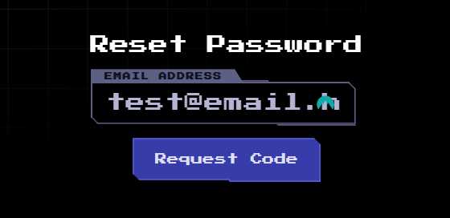
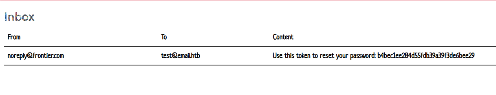
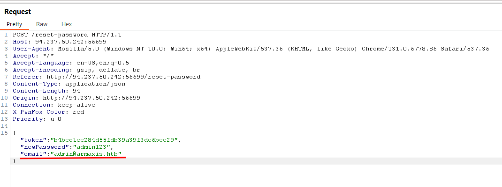
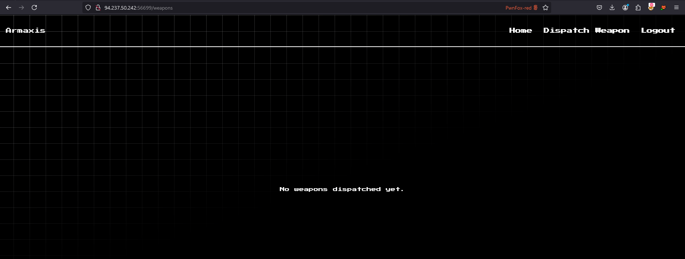
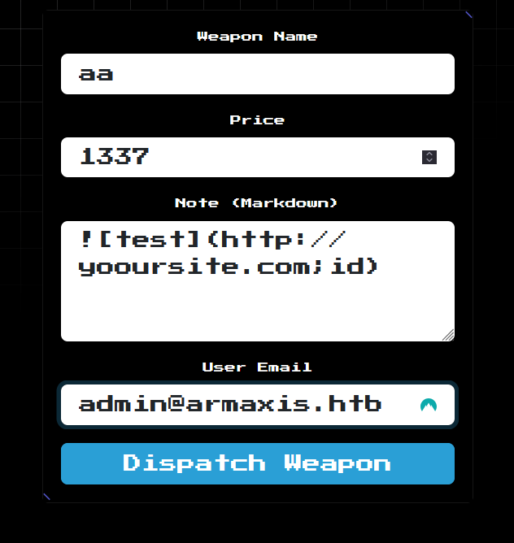
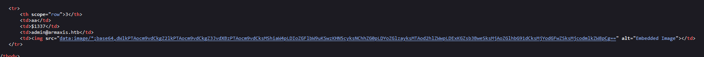
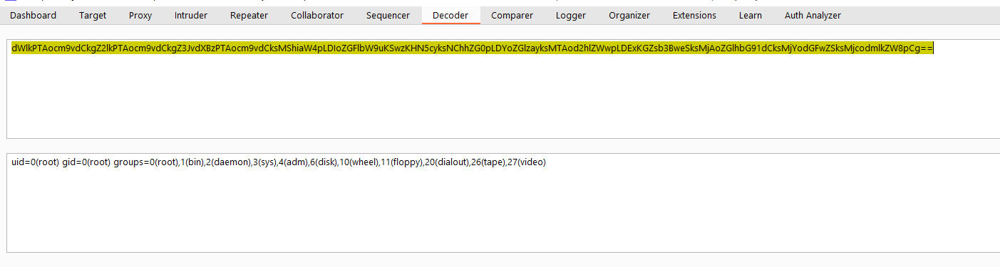
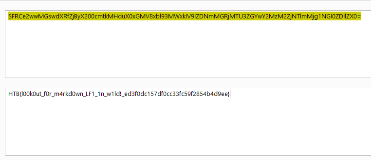

## Web - Armaxis

> In the depths of the Frontier, Armaxis powers the enemy’s dominance, dispatching weapons to crush rebellion. Fortified and hidden, it controls vital supply chains. Yet, a flaw whispers of opportunity, a crack to expose its secrets and disrupt their plans. Can you breach Armaxis and turn its power against tyranny?

## Analysis

We are given nodejs application and email service with address of `test@wmail.htb`. 


Based on the flag location in the source code, we need to at least obtain `File Read` or `Code Execution` within the application.

```Dockerfile
COPY flag.txt /flag.txt
```

After reading the source code, i found that `parseMarkdown` are using `execSync` with unsafe usage. This will allow us to obtain code execution if we manage to control the `url` value.

```js
function parseMarkdown(content) {
    if (!content) return '';
    return md.render(
        content.replace(/\!\[.*?\]\((.*?)\)/g, (match, url) => {
            try {
                const fileContent = execSync(`curl -s ${url}`);
                const base64Content = Buffer.from(fileContent).toString('base64');
                return ``;
            } catch (err) {
                console.error(`Error fetching image from URL ${url}:`, err.message);
                return `<p>Error loading image: ${url}</p>`;
            }
        })
    );
}
```

`url` value are obtain using regex, which will search for markdown image format such as:

```markdown

```

this way, we can inject payload below to obtain code execution

```markdown

```

`parseMarkdown` function was called within `/weapons/dispath` routes and only accessible for user with `admin` privileges.

```js
router.post("/weapons/dispatch", authenticate, async (req, res) => {
  const { role } = req.user;
  if (role !== "admin") return res.status(403).send("Access denied.");

  const { name, price, note, dispatched_to } = req.body;
  if (!name || !price || !note || !dispatched_to) {
    return res.status(400).send("All fields are required.");
  }

  try {
    const parsedNote = parseMarkdown(note);

    await dispatchWeapon(name, price, parsedNote, dispatched_to);

    res.send("Weapon dispatched successfully.");
  } catch (err) {
    console.error("Error dispatching weapon:", err);
    res.status(500).send("Error dispatching weapon.");
  }
});
```

admin users were defined within database initialization below

```js
await runInsertUser(
    "admin@armaxis.htb",
    `${crypto.randomBytes(69).toString("hex")}`,
    "admin",
);
```

To obtain admin credentials, we can perform an account takeover through the reset password feature. This feature allows users to reset their password using a token sent to their email. However, there is no validation to ensure that the token is assigned to the correct user. Additionally, we can supply any email address during the password reset process.

```js
router.post("/reset-password/request", async (req, res) => {
  const { email } = req.body;
  if (!email) return res.status(400).send("Email is required.");

  try {
    const user = await getUserByEmail(email);
    if (!user) return res.status(404).send("User not found.");

    const resetToken = crypto.randomBytes(16).toString("hex");
    const expiresAt = Date.now() + 3600000;

    await createPasswordReset(user.id, resetToken, expiresAt);

    await transporter.sendMail({
      from: "noreply@frontier.com",
      to: email,
      subject: "Password Reset",
      text: `Use this token to reset your password: ${resetToken}`,
    });

    res.send("Password reset token sent to your email.");
  } catch (err) {
    console.error("Error processing reset request:", err);
    res.status(500).send("Error processing reset request.");
  }
});

router.post("/reset-password", async (req, res) => {
  const { token, newPassword, email } = req.body; // Added 'email' parameter
  if (!token || !newPassword || !email)
    return res.status(400).send("Token, email, and new password are required.");

  try {
    const reset = await getPasswordReset(token);
    if (!reset) return res.status(400).send("Invalid or expired token.");

    const user = await getUserByEmail(email);
    if (!user) return res.status(404).send("User not found.");

    await updateUserPassword(user.id, newPassword);
    await deletePasswordReset(token);

    res.send("Password reset successful.");
  } catch (err) {
    console.error("Error resetting password:", err);
    res.status(500).send("Error resetting password.");
  }
});
```

```js
async function getPasswordReset(token) {
  const query = `SELECT * FROM password_resets WHERE token = ? AND expires_at > ?`;
  try {
    const reset = await get(query, [token, Date.now()]);
    return reset;
  } catch (error) {
    throw error;
  }
}
```

## Exploitation

In order to takeover admin account, we need to:

- register using `test@email.htb`
- perform reset password action
  
- obtain reset password token
  
- change email address upon form submission from `test@email.htb` into admin account `admin@armaxis.htb`
  

now we can logged in into admin account


the next step is to exploit code injection within `dispatch weapon` feature


which will reflect in home page


base64-decode the value will show the command output


the last step is to read the flag in `/flag.txt`


Flag : HTB{l00k0ut_f0r_m4rkd0wn_LF1_1n_w1ld!_ed3f0dc157df0cc33fc59f2854b4d9ee}