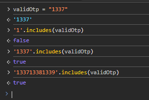
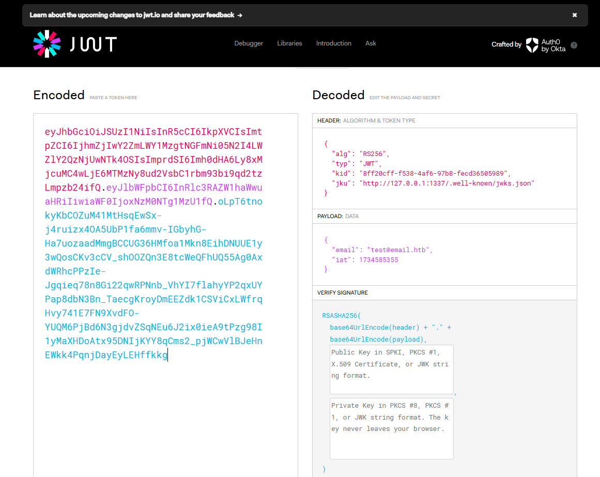
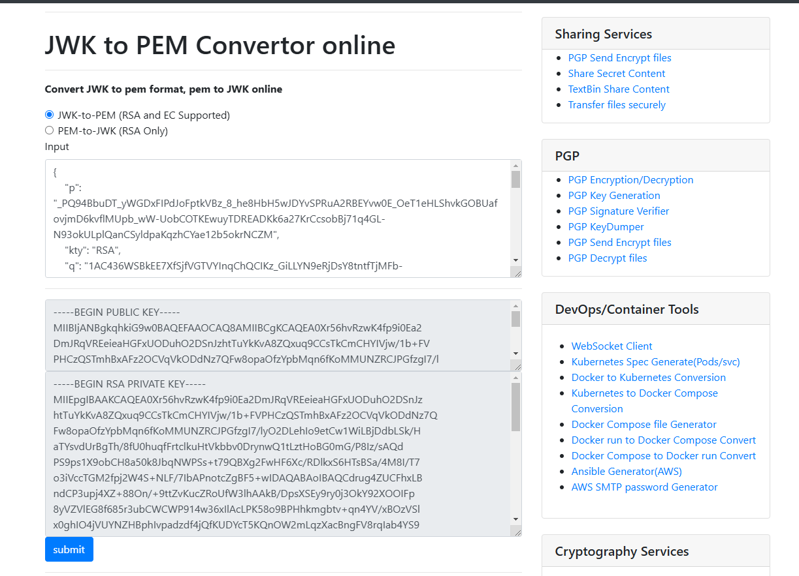
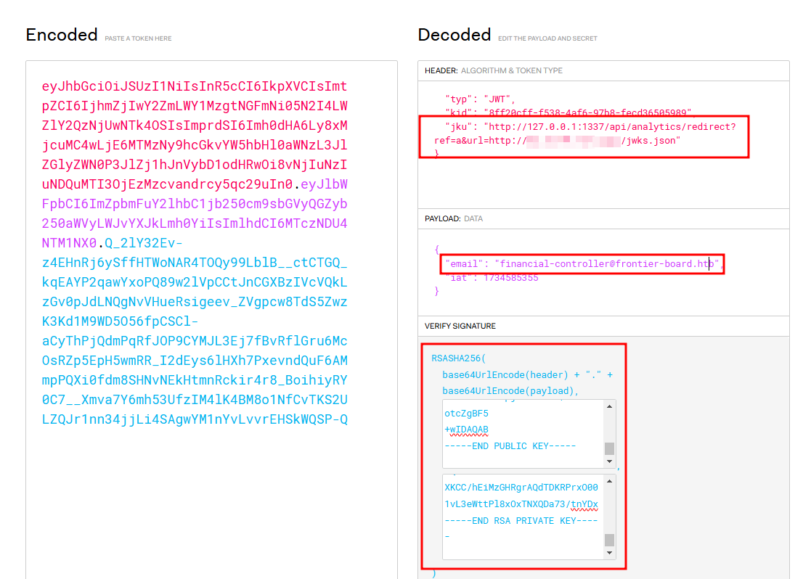
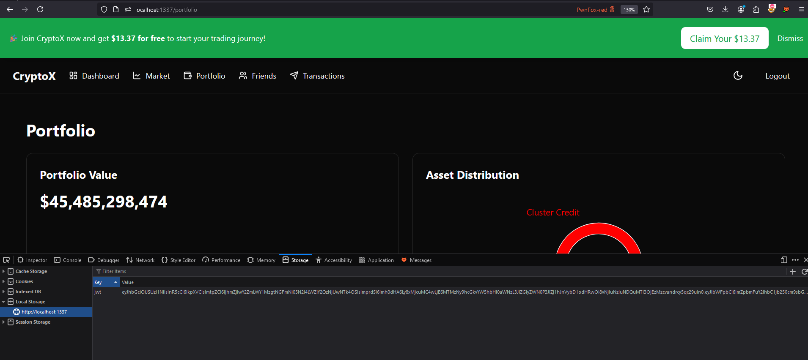
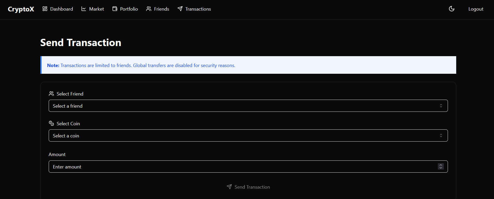
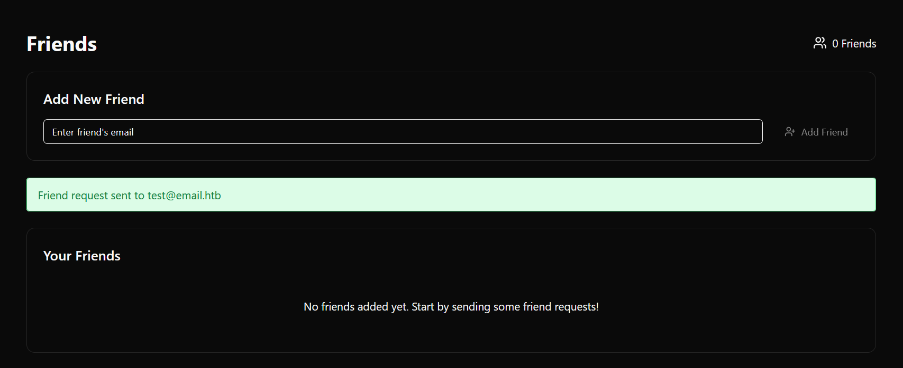
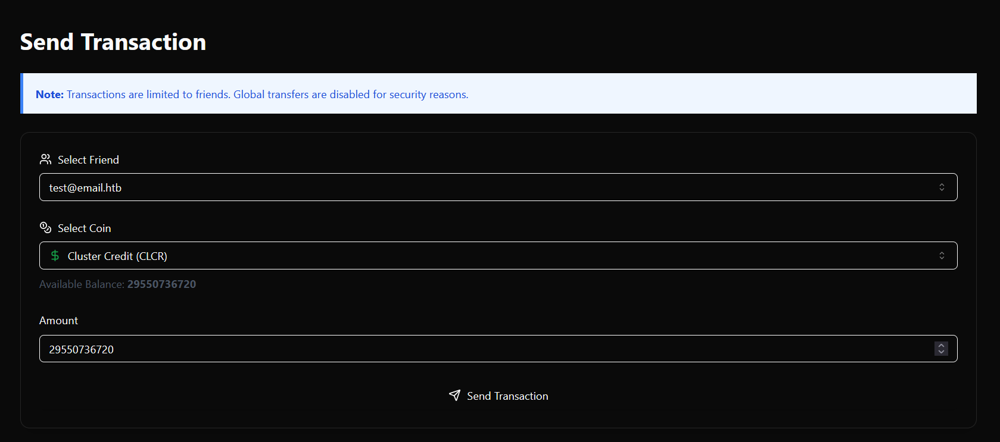
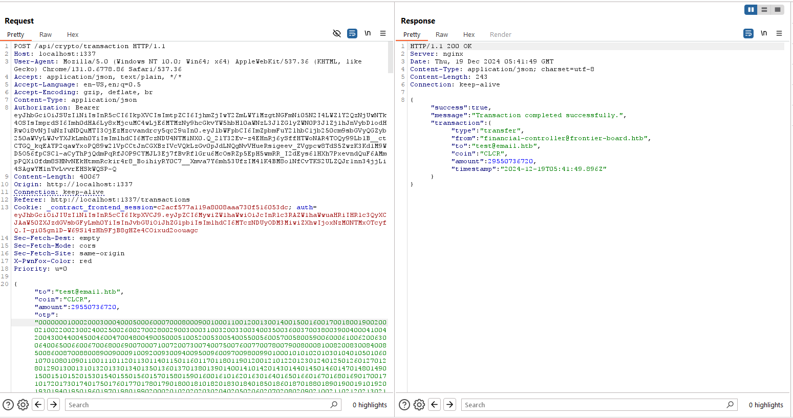
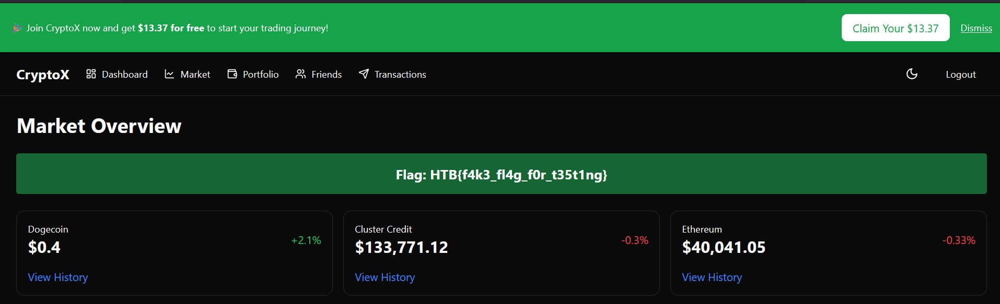

## Web - Breaking Bank
> In the sprawling digital expanse of the Frontier Cluster, the Frontier Board seeks to cement its dominance by targeting the cornerstone of interstellar commerce: Cluster Credit, a decentralized cryptocurrency that keeps the economy alive. With whispers of a sinister 51% attack in motion, the Board aims to gain majority control of the Cluster Credit blockchain, rewriting transaction history and collapsing the fragile economy of the outer systems. Can you hack into the platform and drain the assets for the financial controller?

## Analysis

We are given nodejs application. Flag can be obtained from `checkFinancialControllerDrained` method if CLCR coin balance of `financial-controller@frontier-board.htb` user is less than or equal 0. In other word, we need to drain the wallet of the user.

```js
import { getBalancesForUser } from '../services/coinService.js';
import fs from 'fs/promises';

const FINANCIAL_CONTROLLER_EMAIL = "financial-controller@frontier-board.htb";

/**
 * Checks if the financial controller's CLCR wallet is drained
 * If drained, returns the flag.
 */
export const checkFinancialControllerDrained = async () => {
    const balances = await getBalancesForUser(FINANCIAL_CONTROLLER_EMAIL);
    const clcrBalance = balances.find((coin) => coin.symbol === 'CLCR');

    if (!clcrBalance || clcrBalance.availableBalance <= 0) {
        const flag = (await fs.readFile('/flag.txt', 'utf-8')).trim();
        return { drained: true, flag };
    }

    return { drained: false };
};
```

the `checkFinancialControllerDrained` method are called within `dashboardRouter`. 

```js
import { checkFinancialControllerDrained } from '../services/flagService.js';

export default async function dashboardRouter(fastify) {
    fastify.get('/', async (req, reply) => {
        if (!req.user) {
            reply.status(401).send({ error: 'Unauthorized: User not authenticated' });
            return;
        }

        const { email } = req.user;

        if (!email) {
            reply.status(400).send({ error: 'Email not found in token' });
            return;
        }

        const { drained, flag } = await checkFinancialControllerDrained();

        if (drained) {
            reply.send({ message: 'Welcome to the Dashboard!', flag });
            return;
        }

        reply.send({ message: 'Welcome to the Dashboard!' });
    });
}
```

This function will called when user access `/api/dashboard`.

```js
securedRoutes.register(dashboardRouter, { prefix: '/api/dashboard' });
```

ok, so how can we drain admin wallet? let's analyze more.

### Open Redirection

After reading the source code, i found open redirection bug due to missing checking of `url` parameter.

```js
export default async function analyticsRoutes(fastify) {
    fastify.get('/redirect', async (req, reply) => {
        const { url, ref } = req.query;

        if (!url || !ref) {
            return reply.status(400).send({ error: 'Missing URL or ref parameter' });
        }
        // TODO: Should we restrict the URLs we redirect users to?
        try {
            await trackClick(ref, decodeURIComponent(url));
            reply.header('Location', decodeURIComponent(url)).status(302).send();
        } catch (error) {
            console.error('[Analytics] Error during redirect:', error.message);
            reply.status(500).send({ error: 'Failed to track analytics data.' });
        }
    });

    fastify.get('/data', async (req, reply) => {
        const { start = 0, limit = 10 } = req.query;

        try {
            const analyticsData = await getAnalyticsData(parseInt(start), parseInt(limit));
            reply.send(analyticsData);
        } catch (error) {
            console.error('[Analytics] Error fetching data:', error.message);
            reply.status(500).send({ error: 'Failed to fetch analytics data.' });
        }
    });
}
```

this route are defined with

```js
fastify.register(analyticsRoutes, { prefix: '/api/analytics' });
```

so we can perform open redirection using following url `/api/analytics/redirect?ref=a&url=redirected.com`

### JWKS Spoofing

The application uses `RS256` algorithm. This mean that JWT token will be signed using Private Key and validated using Public Key.

There's a weakness in the token validation mechanism that lead to JWKS Spoofing.

```js
export const verifyToken = async (token) => {
    try {
        const decodedHeader = jwt.decode(token, { complete: true });

        if (!decodedHeader || !decodedHeader.header) {
            throw new Error('Invalid token: Missing header');
        }

        const { kid, jku } = decodedHeader.header;

        if (!jku) {
            throw new Error('Invalid token: Missing header jku');
        }

        // TODO: is this secure enough?
        if (!jku.startsWith('http://127.0.0.1:1337/')) {
            throw new Error('Invalid token: jku claim does not start with http://127.0.0.1:1337/');
        }

        if (!kid) {
            throw new Error('Invalid token: Missing header kid');
        }

        if (kid !== KEY_ID) {
            return new Error('Invalid token: kid does not match the expected key ID');
        }

        let jwks;
        try {
            const response = await axios.get(jku);
            if (response.status !== 200) {
                throw new Error(`Failed to fetch JWKS: HTTP ${response.status}`);
            }
            jwks = response.data;
        } catch (error) {
            throw new Error(`Error fetching JWKS from jku: ${error.message}`);
        }

        if (!jwks || !Array.isArray(jwks.keys)) {
            throw new Error('Invalid JWKS: Expected keys array');
        }

        const jwk = jwks.keys.find((key) => key.kid === kid);
        if (!jwk) {
            throw new Error('Invalid token: kid not found in JWKS');
        }

        if (jwk.alg !== 'RS256') {
            throw new Error('Invalid key algorithm: Expected RS256');
        }

        if (!jwk.n || !jwk.e) {
            throw new Error('Invalid JWK: Missing modulus (n) or exponent (e)');
        }

        const publicKey = jwkToPem(jwk);

        const decoded = jwt.verify(token, publicKey, { algorithms: ['RS256'] });
        return decoded;
    } catch (error) {
        console.error(`Token verification failed: ${error.message}`);
        throw error;
    }
};
```

it will try to decode jwt token, parse `jku` and check wether it starts with `http://127.0.0.1:1337/`. This approach is unsafe if open redirection is found in the application. Luckily, we already found open redirect vulnerability earlier.

We can use redirection to bypass the validation by using link such as `http://127.0.0.1:1337/redirect?url=evil.com` so it will fetch content from `evil.com` instead of `127.0.0.1`. This way we can provide our own public key for token validation, while encrypting the token using our own private key.

Using this method, we can create arbitrary token and able to logged in as anyone in the site.

### OTP Bypass


In order to perform transaction, application will try to perform several check

```js
fastify.post(
    '/transaction',
    { preHandler: [rateLimiterMiddleware(), otpMiddleware()] },
    async (req, reply) => {
        const { to, coin, amount } = req.body;
        const userId = req.user.email; 
    
        try {
        if (!to || !coin || !amount) {
            return reply.status(400).send({ error: "Missing required fields" });
        }
        
        const supportedCoins = await getSupportedCoins(); 
        if (!supportedCoins.includes(coin.toUpperCase())) {
            return reply.status(400).send({ error: "Unsupported coin symbol." });
        }
        
        const parsedAmount = parseFloat(amount);
        if (isNaN(parsedAmount) || parsedAmount <= 0) {
            return reply.status(400).send({ error: "Amount must be a positive number." });
        }

        const userExists = await validateUserExists(to);
        if (!userExists) {
            return reply.status(404).send({ error: "Recipient user does not exist." });
        }
    
        if (userId === to) {
            return reply.status(400).send({ error: "Cannot perform transactions to yourself." });
        }

        const result = await transactionByEmail(to, userId, parseFloat(amount), coin.toUpperCase());
    
        if (!result.success) {
            return reply.status(result.status).send({ error: result.error });
        }
    
        reply.send(result);
        } catch (err) {
        console.error("Transaction error:", err);
        reply.status(err.status || 500).send({ error: err.error || "An unknown error occurred during the transaction." });
        }
    }
    );
```

It also uses two middleware before performing those checks.

frist one is `rateLimiterMiddleware()` which prevent bruteforce attemp by limiting only 5 request per minute.

```js
import { hsetField, hgetField, expireKey } from '../utils/redisUtils.js';

export const rateLimiterMiddleware = (limit = 5, windowInSeconds = 60) => {
  return async (req, reply) => {
    const userId = req.user.email;
    const redisKey = `rate-limit:${userId}`;

    let currentCount = await hgetField(redisKey, 'count');
    if (!currentCount) {
      currentCount = 1;
      await hsetField(redisKey, 'count', currentCount);
      await expireKey(redisKey, windowInSeconds);
    } else {
      currentCount = parseInt(currentCount, 10) + 1;
      await hsetField(redisKey, 'count', currentCount);
    }

    if (currentCount > limit) {
      reply.status(429).send({ error: 'Too many requests. Please try again later.' });
      return;
    }
  };
};

```

second is `otpMiddleware()` which will checks for user OTP in redis.

```js
import { hgetField } from '../utils/redisUtils.js';

export const otpMiddleware = () => {
  return async (req, reply) => {
    const userId = req.user.email;
    const { otp } = req.body;

    const redisKey = `otp:${userId}`;
    const validOtp = await hgetField(redisKey, 'otp');

    console.log(validOtp)

    if (!otp) {
      reply.status(401).send({ error: 'OTP is missing.' });
      return
    }

    if (!validOtp) {
      reply.status(401).send({ error: 'OTP expired or invalid.' });
      return;
    }

    // TODO: Is this secure enough?
    if (!otp.includes(validOtp)) {
      reply.status(401).send({ error: 'Invalid OTP.' });
      return;
    }
  };
};
```

the otp are generated in the server and not given to user. The OTP is being generated for every one minute. So bruteforcing OTP is impossible.

```js
export const generateOtp = () => {
  return Math.floor(1000 + Math.random() * 9000).toString();
};

export const setOtpForUser = async (userId) => {
  const otp = generateOtp();
  const ttl = 60;

  await setHash(`otp:${userId}`, { otp, expiresAt: Date.now() + ttl * 1000 });

  return otp;
};

export const rotateOtps = async () => {
  try {
    const userKeys = await getKeysByPattern('user:*');

    const rotatePromises = userKeys.map(async (userKey) => {
      const userId = userKey.split(':')[1];
      await setOtpForUser(userId);
    });

    await Promise.all(rotatePromises);
  } catch (error) {
    console.error('Error during OTP rotation:', error);
  }
};


export const safelyRotateOtps = async () => {
  if (isRotating) {
    console.warn('Previous OTP rotation is still in progress. Skipping this interval.');
    return;
  }

  isRotating = true;
  try {
    await rotateOtps();
  } catch (error) {
    console.error('Error during OTP rotation:', error);
  } finally {
    isRotating = false;
  }
};

setInterval(safelyRotateOtps, 60000);

```

However there's weak validation mechanism for OTP verification because it uses the `includes()` method, which checks if the valid OTP is <mark>anywhere</mark> in the user's input.

```js
if (!otp.includes(validOtp)) {
    reply.status(401).send({ error: 'Invalid OTP.' });
    return;
}
```

check test case below. Although input is not the same, but if the string is "included" in the full string, then it will return true.



This way, we can insert all possible combination of otp in single request, bypassing the validation.

## Exploitation

so here's the full attack chain:
- Bypass JWT to logged in as admin
- Bypass OTP to drain user balance
- Access the flag

let's register in the website first


then login to the site


We get valid JWT token in `jwt` localstorage. 


and we can also get sample of `jwks.json` value.

```json
{
  "keys": [
    {
      "kty": "RSA",
      "n": "tgSoSdh8tbodjwpc4hBKBs_0nZG5Fktdnk6gx401f66G93ibpGthzCdaPpP4fABrImpjO3qg8roK7OKFoxj6DpYINgD1LxUqyaOO3Mm3ZoL_EgKKPzKgUmNZKwL-br6g9JvrlVNjAgG1xmL7csezJ3qaX2FJ21sihvHFa7EiGbydY4sOiEw8p24TfWAi8exaw2DaYeEyj-CoCzhxSzahZR5H9Rc5NnCkhVrK1TIaZAOCFAVs0WAC4BTxPS9MJjgPTEbec97VozzXXOu3c4qIrB0GYM8-gtzEWwqKHLi4uDoSwzeevjbzfbwOE0F_LOFHb7piQBH2dJ78y8rPtIXhYQ",
      "e": "AQAB",
      "alg": "RS256",
      "use": "sig",
      "kid": "8ff20cff-f538-4af6-97b8-fecd36505989"
    }
  ]
}
```

now let's create pairs of public & private key. I'll use [https://mkjwk.org/](https://mkjwk.org/)

fill all the required field and generate new key. 


Serve `public and private keypair set` to your vps.

now convert the generated keypairs into PEM format. I'll using [https://8gwifi.org/](https://8gwifi.org/jwkconvertfunctions.jsp). You can use `Public and Private Keypair` from previous site.



now modify token from jwt.io site


change value of `jwt` in local storage and refresh. Now we're logged in as admin.



It seems like we need to add friend first to be able to transfer money


let's add friend using our registered user


login using our user, and accept friend request from admin


now sent all CLCR coin to our user


using following code, i can generate all combination of otp

```python
print(''.join(f"{i:04d}" for i in range(10000)))
```

now sent the modified request. it was accepted


now if we go back to the dashboard, flag will be given


perform same attack in the remote instances to obtain real flag :)

Flag: HTB{rugg3d_pu11ed_c0nqu3r3d_d14m0nd_h4nd5_c1f72c32f8eb7a20278ef19559bd03ae}
