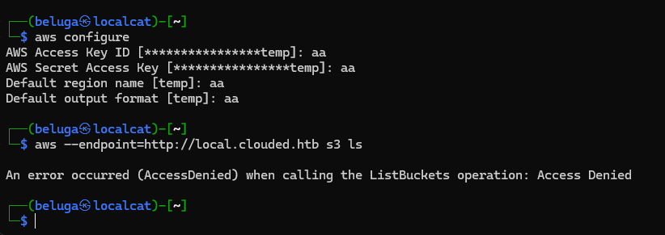

## Fullpwn - Clouded

> In the lawless expanse of the Frontier Cluster, Clouded emerges as a beacon of efficiency and security for file sharing. Breakthrough their cloud servers to obtain the secrets to finding the Starry Spur. Allow up to 1 minute for all the services to properly boot.


## User

### Enumeration

Upon scanning the ports, we found that port 22 and 80 are open.

when try to access the port 80, it was redirected into `clouded.htb`. We try to enumerate subdomain using ffuf command below, and found other subdomain named `local.clouded.htb`


we add those two hostnames into `/etc/hosts`.

### Web application


The web page have several page, but the intersting one is `Upload` page. It allows user to upload several type of content.


If we try to upload any content, it will return uploaded file location from `local.clouded.htb` subdomain.


### Cloud instances

Using curl, i was able to identify that the site was hosted using aws, probably an s3 bucket


I try to use `aws-cli` to enumerate the instances further, however i got permission denied


i then try to enumerate further, started with directory enumration. I found that the application accept urlencoded form of `?`.


and after playing with other character, i noticed that the site also vulnerable to directory traversal, which allow me to bypass the restriction and access the bucket.


it have file named `backup.db` which can be downloaded directly using link below
`http://local.clouded.htb/uploads/..%2F/clouded-internal/backup.db`


the backup contains a lot of name and password in md5 format.


### SSH Bruteforce

i managed to crack all the password and proceeding to create wordlists based on available information.

i've tried multiple username combination based on [username-anarchy](https://github.com/urbanadventurer/username-anarchy). but in the end, the pair was simple. It was lastname:password.

I managed to obtain correct credentials, which was `nagato:alicia`


flag was located in `/home/nagato/flag.txt`


## Root

After obtaining low privilege user, i try to enumerate further. Aparently, `nagato` is part of `frontiers` group, which have access for `/opt/infra-setup`.


It containing yml script, potentially used for healthcheck.


If we try to monitor any process using [pspy](https://github.com/DominicBreuker/pspy), then we can see that root user are running `ansible` using yml file mentioned before.


### ansible-playbook rce

Using script from [0xdf](https://0xdf.gitlab.io/2021/11/13/htb-seal.html#shell-as-root), we can gain command execution using following yml code. Note that i made modification because i was lazy to setup reverse shell in my windows machine lol.

```yml
- hosts: localhost
  tasks:
  - name: rev
    shell: bash -c 'chmod u+s /bin/bash'
```

since we dont have write permission into `checkup.yml`, we can't modify the file directly. However since we have write permission on the directory itself, we can delete or rename the file into something else. This way, we can create new file with name of `checkup.yml` and inject the malicious script.


After waiting for a while, the `/bin/bash` permission was modified into a SUID binary. Now we can obtain root shell by executing `/bin/bash -p`

root flag obtained!


Flag: HTB{H@ZY_71ME5_AH3AD}