## Fullpwn - Freedom

> In these challenging times, the voices of freedom are growing fainter. Help us identify potential vulnerabilities in our systems so we can safeguard them against the Frontier Board, which seeks to silence any dissenting opinions. Allow up to 3 minutes for all the services to properly boot.

## User

### Enumeration

starting with port canning, we found that the machine are running Windows due to kerberos port (88) opened.

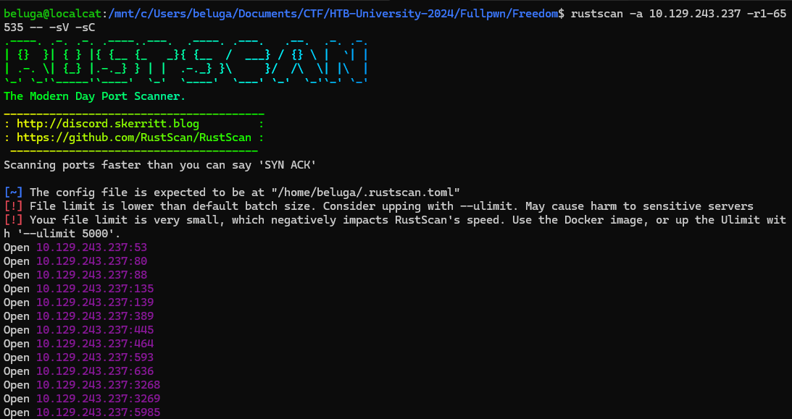

### Web Application

I started to enumerate web apps, which redirected into `/index.cfm`.
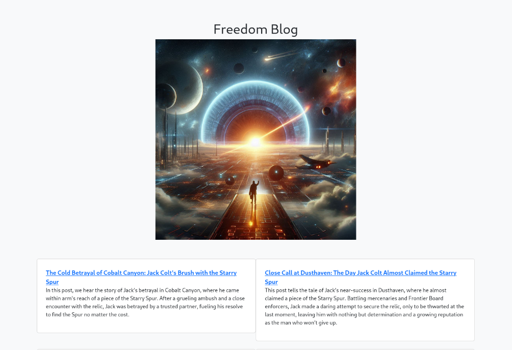

`cfm` file extension are used for `ColdFusion`.
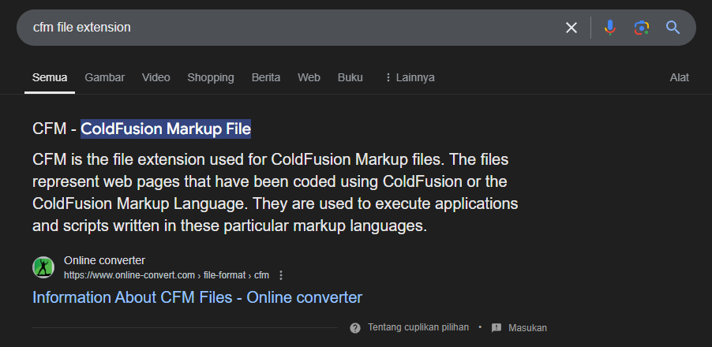

there's nothing much in the landing page, which then i decided to perform directory scan. Here i found several interesting results such as `/README.md` and `/admin`
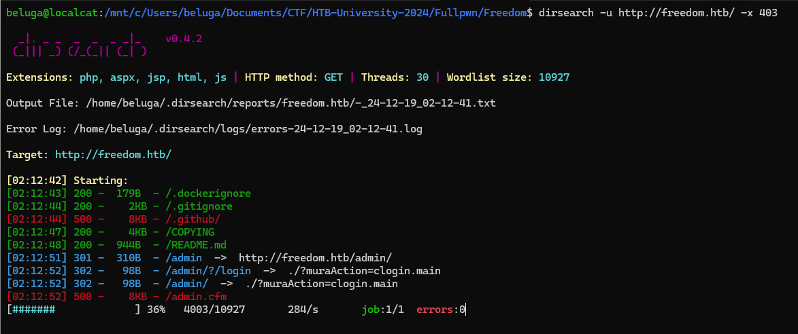

In the `README.md` files, i found that web application running `Masa CMS`
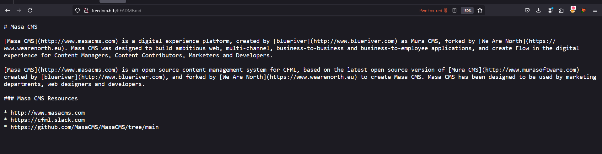

if we try to open the `/admin` path, then we can also confirm that `Masa CMS` is being used.
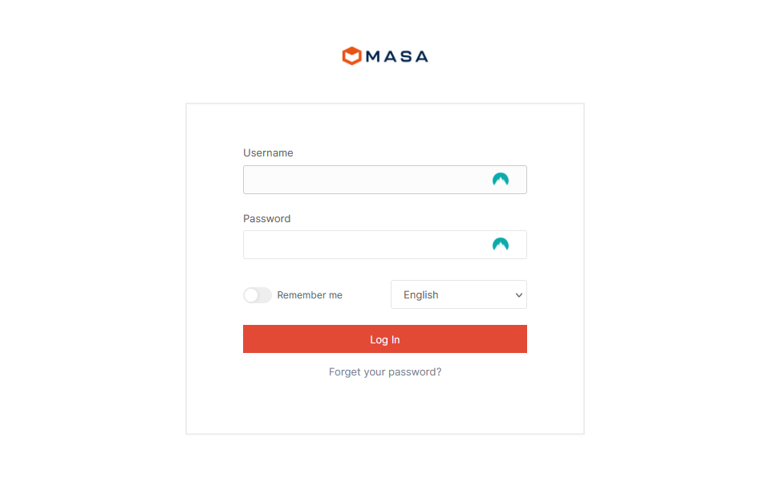

continuing with the directory scan, i found other interesting files named `box.json`. It seems like version 7.4.5 or `Masa CMS` is being used right now.

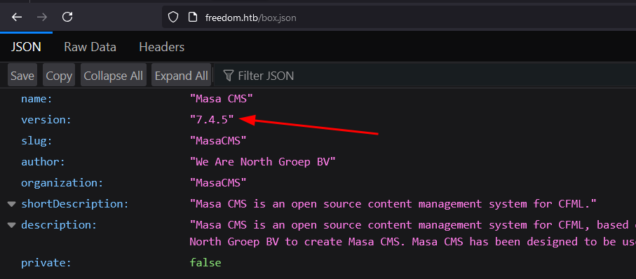

### MasaCMS Exploit

After searching for known exploit of `Masa CMS`, i found this interesting article by [projectdiscovery](https://projectdiscovery.io/blog/hacking-apple-with-sql-injection) which disclose about pre-auth sql injection in `Masa CMS` version 7.4.5. Perfect!

They also provide attack scenario to obtain RCE in the `Masa CMS` as well.
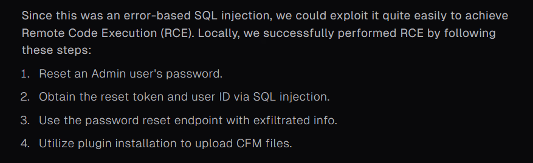

Based on the article, it seems like the `Masa CMS` are vulnerable to error-based SQL Injection. So i use sqlmap to dump the database.

```bash
 sqlmap "http://freedom.htb/index.cfm/_api/json/v1/default/?method=processAsyncObject&object=displayregion&contenthistid=x&previewID=x" -p contenthistid --level 5 --risk 3 --technique=E --prefix="%5c'" --batch
```
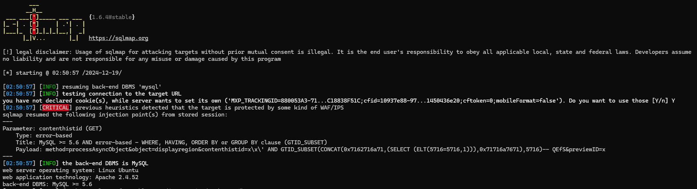

Alternatively, we can also view the [database schema](https://github.com/MasaCMS/MasaCMS/blob/main/core/setup/db/mysql.sql) in the source code.

In order to achieve RCE, we need to reset user password. I use following command to dump user lists from database.

```bash
sqlmap "http://freedom.htb/index.cfm/_api/json/v1/default/?method=processAsyncObject&object=displayregion&contenthistid=x&previewID=x" -p contenthistid --level 5 --risk 3 --technique=E --prefix="x%5c'" --batch --dump -D dbMasaCMS -T tusers
```

it seems like admin email was `admin@freedom.htb`

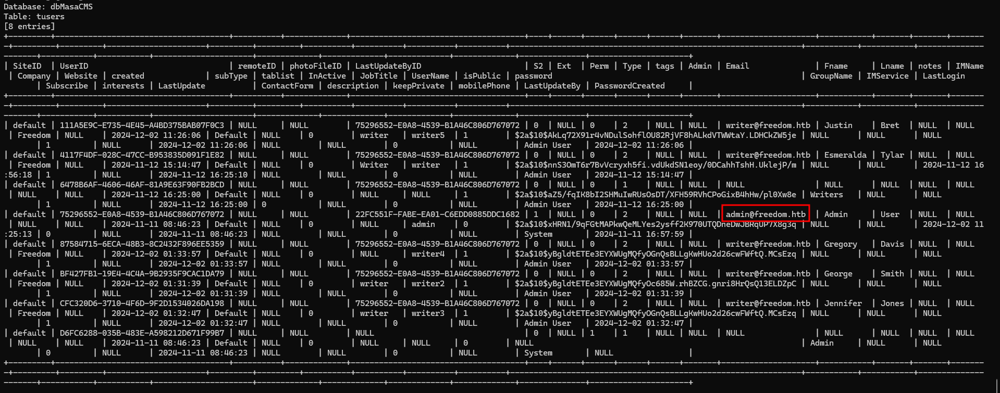

using the email address, we can invoke password reset from the `/admin` endpoint.

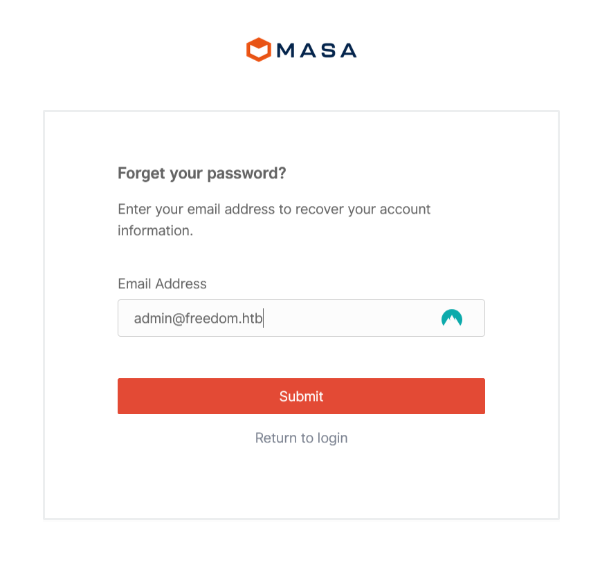

After that, we need to obtain reset token and user id from database. We didn't know where exactly the value is, and try to dump all table in `dbMasaCMS` database instead.

After waiting for a while, we found interesting output within `tredirects` table.

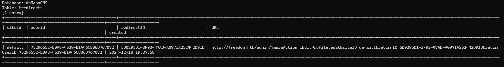

The url can be used to reset admin password, nice!

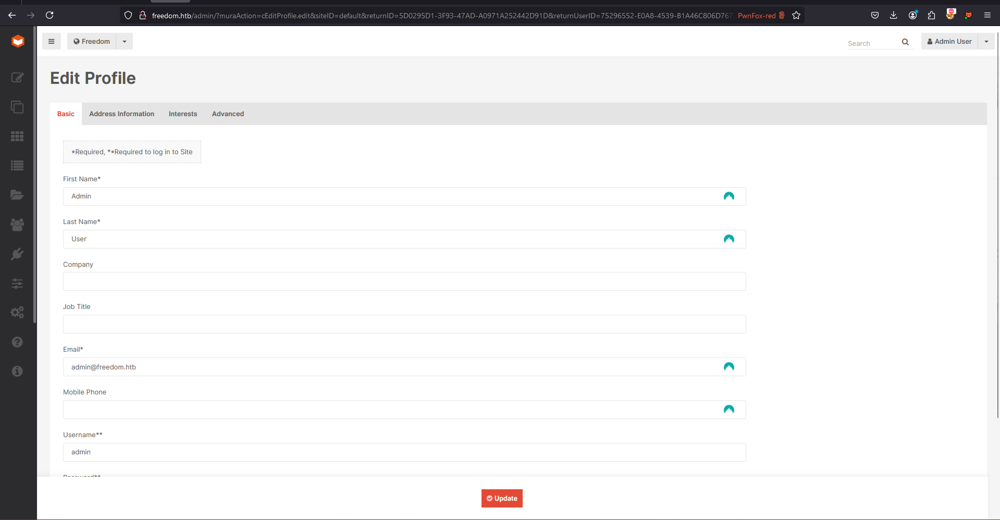

#### Crafting MuraCMS Plugin

in order to obtain code execution, we need to upload our own plugin. This can be performed under `Plugins > Add Plugin` menu.
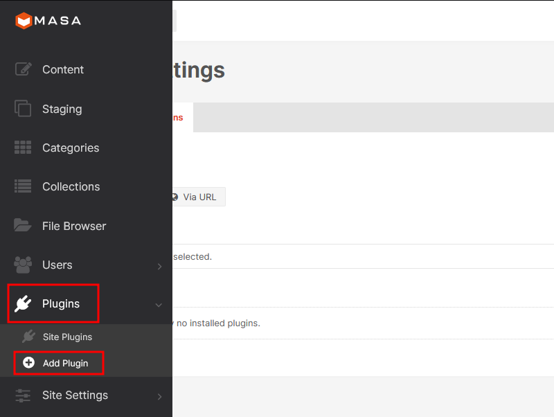

I was lazy to create the plugin from scratch, so i decided to search for public available plugin, which i found from the [MasaCMS repository itself](https://github.com/MasaCMS/MasaGoogleSitemaps)

I replace the content of `MasaGoogleSitemaps-main\admin\views\main\default.cfm` using backdoor shell from [laudanum](https://github.com/jbarcia/Web-Shells/blob/master/laudanum/cfm/shell.cfm).

Then i zip the plugin content and uploaded it. However, it shows error like this.

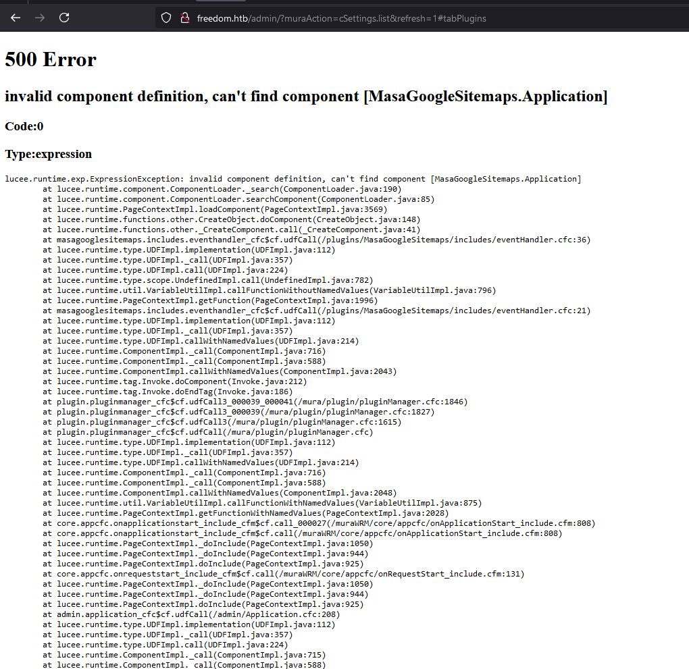

Fortunately, this error can be ignored. I just need to back to previous page and click for `update` button.

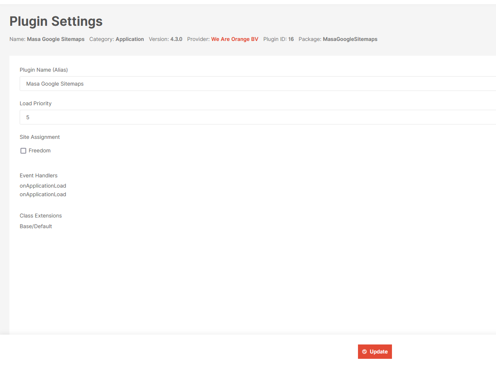

Voila, plugin is uploaded!
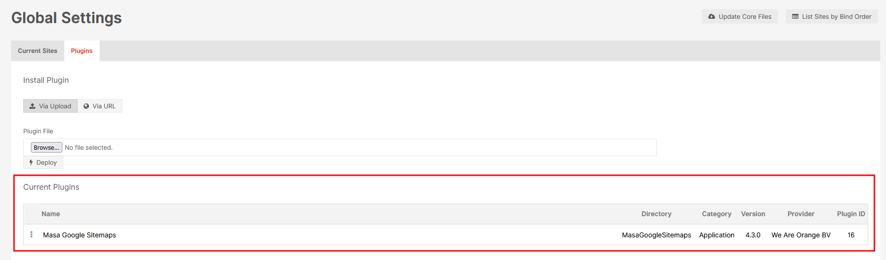

To access the plugin, click on it's name
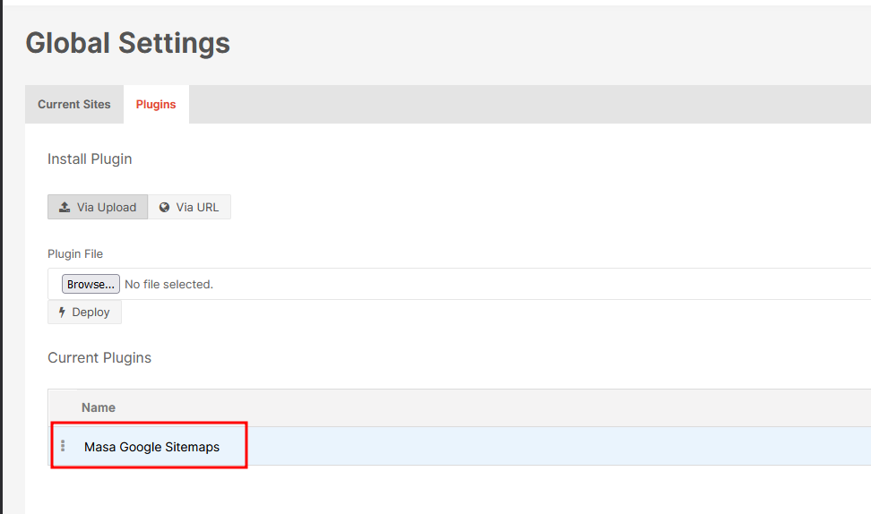

This will redirect into `/plugins/MasaGoogleSitemaps/` with forbidden result, what??
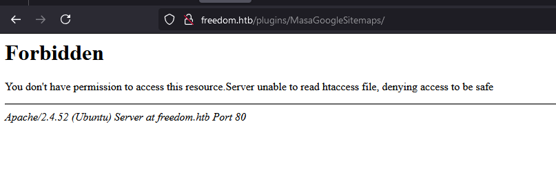

Luckily, we can remove the restriction by appending `/index.cfm` to the site. Shell is now opened, however we can't see the content due to access restriction in the shell itself.
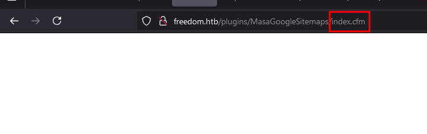

We need to set `X-Auth-Code` header with value taken from the source code.
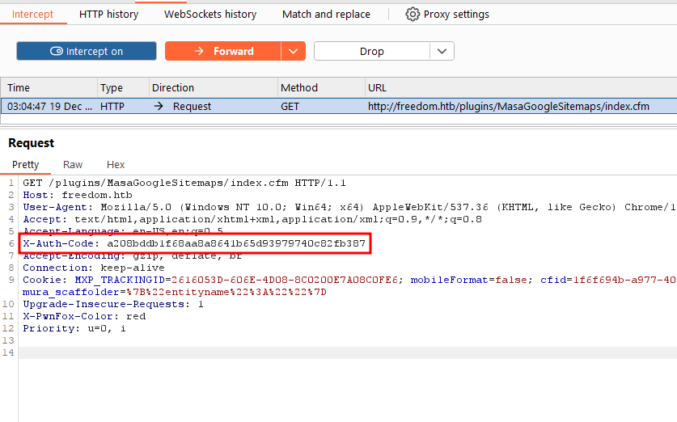

Shell can be accessed now
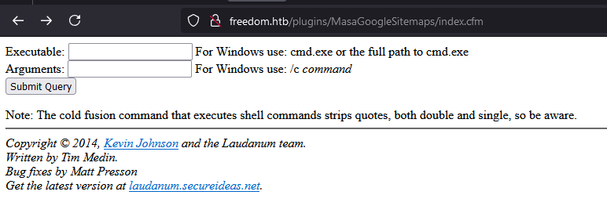

### WSL Escape?

When i execute `whoami`, it returning `root` instead of windows user??
I easily guess that this is probably wsl. 
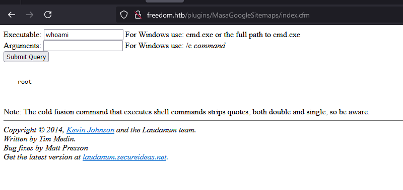

Using `mount` command, i found that this is indeed an wsl intances that mounting drive `C:\` from windows.
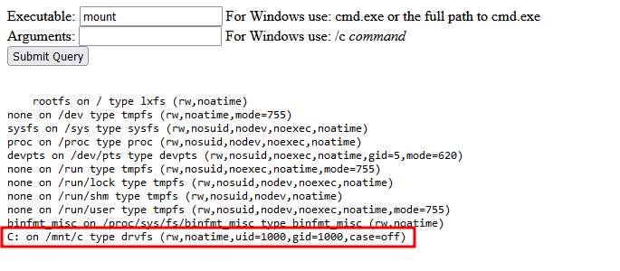

We can access windows file's from it.
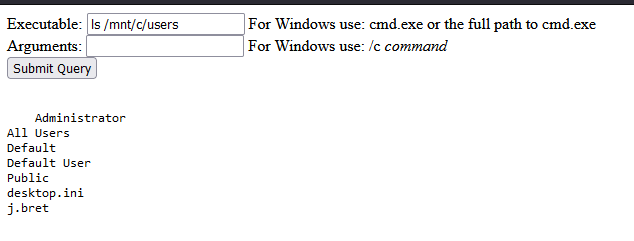

User flag also can be obtained within `/mnt/c/Users/j.bret/Desktop/user.txt`

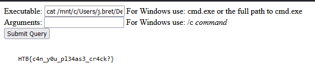

Flag: HTB{c4n_y0u_pl34as3_cr4ck?}

## Root
well, this is weird. But we can also read root flag using wsl privileges lol

root flag located in `/mnt/c/Users/Administrator/Desktop/root.txt`

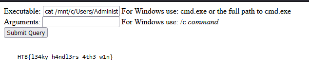

Flag:HTB{l34ky_h4ndl3rs_4th3_w1n}